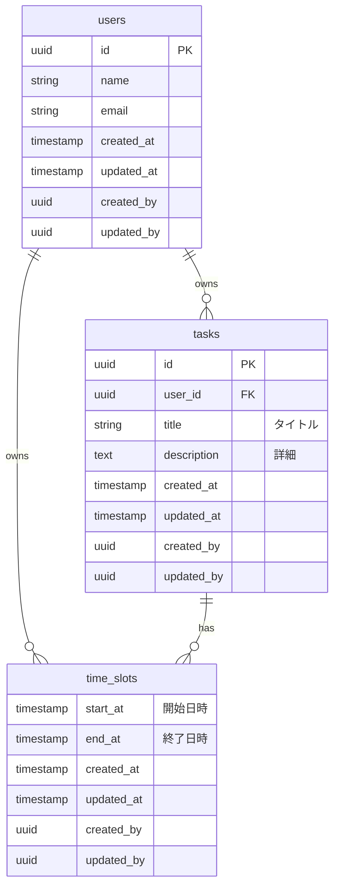

# テーブル定義書

## 概要
**ParallelCalendar（予実管理カレンダー）**
「タスク（Task）」を定義し、それを複数の「アロケーション（Allocation / 層）」に割り当てて管理する。
基本構造としては、**1つのタスクに対し、アロケーション（予定・実績など）ごとに1つの時間枠（TimeSlot）を持つ** 形となる。

## ER図 (Mermaid)

## テーブル定義詳細

### 1. users (ユーザー)
アプリケーションの利用者。

| カラム名 | データ型 | 制約 | 説明 |
| :--- | :--- | :--- | :--- |
| `id` | UUID | PK | ユーザーID |
| `name` | VARCHAR | NOT NULL | 表示名 |
| `email` | VARCHAR | UNIQUE | メールアドレス |
| `created_at` | TIMESTAMPTZ | DEFAULT NOW() | 作成日時 |
| `updated_at` | TIMESTAMPTZ | DEFAULT NOW() | 更新日時 |
| `created_by` | UUID | FK -> users.id | 作成者 |
| `updated_by` | UUID | FK -> users.id | 更新者 |

### 2. tasks (タスク/定義)
「何をするか」というアセットそのもの。これがマスターデータとなる。
時間情報はここには持たず、あくまで「やること」の定義。

| カラム名 | データ型 | 制約 | 説明 |
| :--- | :--- | :--- | :--- |
| `id` | UUID | PK |  |
| `user_id` | UUID | FK -> users.id | 所有者 |
| `title` | VARCHAR | NOT NULL | タスク名（例：英語学習） |
| `description` | TEXT |  | 詳細メモ |
| `created_at` | TIMESTAMPTZ | DEFAULT NOW() | 作成日時 |
| `updated_at` | TIMESTAMPTZ | DEFAULT NOW() | 更新日時 |
| `created_by` | UUID | FK -> users.id | 作成者 |
| `updated_by` | UUID | FK -> users.id | 更新者 |

### 3. time_slots (時間帯/コマ)
タスクに紐付く具体的な時間枠。`type` カラムで「予定」か「実績」かといった区分を管理する。
1つのタスクに複数のTimeSlotを紐付けられるため、**「予定なし・実績のみ」** や **「予定あり・実績なし」** といったケースも、単にレコードが存在するかどうかで表現可能。

| カラム名 | データ型 | 制約 | 説明 |
| :--- | :--- | :--- | :--- |
| `id` | UUID | PK |  |
| `user_id` | UUID | FK -> users.id | 所有者 |
| `task_id` | UUID | FK -> tasks.id | 実行するタスク |
| `type` | VARCHAR | NOT NULL | `PLAN`, `ACTUAL` 等の区分 |
| `start_at` | TIMESTAMPTZ | NOT NULL | 開始日時 |
| `end_at` | TIMESTAMPTZ | NOT NULL | 終了日時 |
| `created_at` | TIMESTAMPTZ | DEFAULT NOW() | 作成日時 |
| `updated_at` | TIMESTAMPTZ | DEFAULT NOW() | 更新日時 |
| `created_by` | UUID | FK -> users.id | 作成者 |
| `updated_by` | UUID | FK -> users.id | 更新者 |
