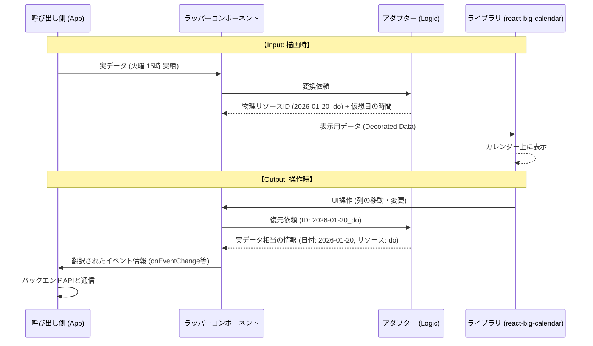

# react-big-calendarの使い方の工夫

## 実現したいこと（目的）
1日の「予定」と「実績」だけでなく、それを複数日にわたって一画面で並列表示したい。
本来は単一日しか表示できない Vertical ビューを、内部ではある1日の14リソースの表示だが、仮想的に1週間ぶんの予定と実績のように扱う。

## ライブラリ活用のハック（Adapter / Wrapper の論理）
ライブラリには、「日付×意味的リソース」で1つの物理的リソースとして渡す。
※「意味的リソース」とは、例えば「予定」や「実績」のような意味を持つリソースを指す。
※日付またぎのスケジュールを扱うロジック等は要検討

## データの変換フロー（Data Cycle）

## Wrapperのインターフェース要件

1. プロパティの透過的パススルー契約 (Transparent Pass-through)
- 設計指針
    - ラッパー固有で管理する「日付(date)」と「リソース(resources)」を除き、それ以外の全ての引数は react-big-calendar 本体の仕様をそのまま受け入れ、透過的にライブラリへ引き渡す。
- メリット
    - 利用者はライブラリのドキュメント（イベントの色分け、時間間隔の設定など）をそのまま参照でき、ラッパー側での再定義（二重管理）を避ける。
2. N×M 座標系の自動マッピング要件
- 設計指針
    - 「列（レーン）」の生成は、M日の日付 × N個の意味的リソースの組み合わせによってWrapper内部で自動計算される。
- ID設計
    - 物理的な resourceId は、常に [日付]_[意味的リソースID] というエンコード形式を維持し、WrapperはこのIDの生成と分解のみに責任を持つ。
- 制約
    - 現在の要件では、臨時リソース等の例外は扱わず、常に規則的な格子状の座標系を提供する。
3. 往復のデータ変換契約 (Two-way Translation)
- 変換の責務
    - 呼び出し側から渡されたドメインデータ（実データ）の形状は破壊せず、ライブラリが必要な「表示用情報（仮想日付等）」を付加（Decorate）して表示する。
- 戻り値の復元
    - ユーザー操作が発生した際、Wrapperは内部で「物理座標」を「実日付」と「意味的リソース」に復号し、呼び出し側には実データの文脈に翻訳された情報を返す。
    - 例）「仮想日の第3列への移動」を、「1月20日の『実績』への変更」として伝搬する。

### Wrapperのインターフェース
以下の4点を引数として受け取る。
1. 開始日
2. 日数
3. リソース
4. ライブラリのPropsから開始日とリソースを除いたもの

## Adapterの役割
Adapterは、実データ⇔表示用データを変換する役割を果たす。
1. 実データ（特に日付と意味的リソース）を受け取り、物理リソースIDに変換する
    - 受け取った実データを、仮想日の物理リソースのカレンダーデータに変換する
2. 物理リソースIDを受け取り、実データの日付と意味的リソースに変換する
    - 受け取った物理リソースIDを、実データの日付と意味的リソースに変換し、時刻情報と合わせて実データに変換する