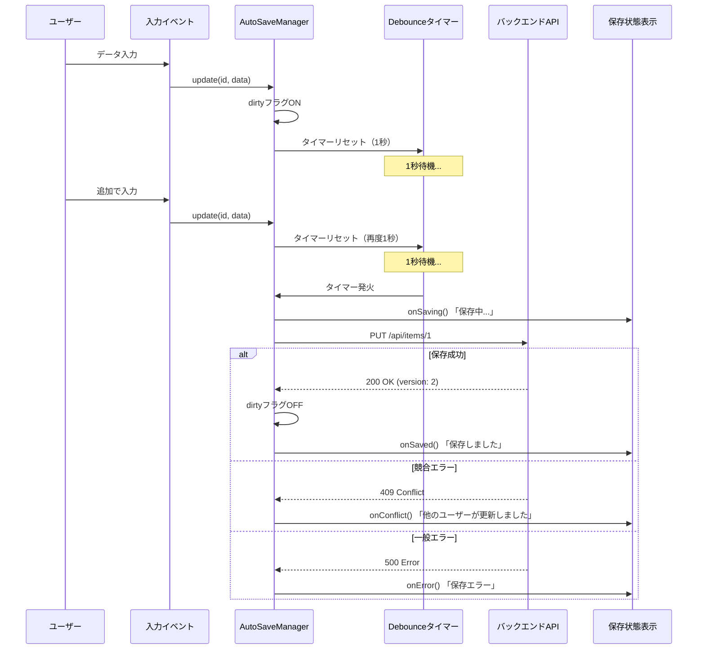

# @tools/auto-save

Googleスプレッドシート的な自動保存機能を、どんなJavaScriptフレームワークでも使えるツール。

## 特徴

- **Debounce自動保存**（デフォルト1秒、入力停止後に保存）
- **差分検知**（変更されたアイテムのみ保存、重複保存を防止）
- **楽観ロック対応**（versionベースの競合検出）
- **保存状態管理**（「保存中...」「保存しました」などの状態）
- **フレームワーク非依存**（React、Vue、Vanilla JSで動作）
- **シンプルなAPI**（入力時に`update()`を呼ぶだけ）

## インストール

### モノレポ内で使用（推奨）

このツールは `App/` モノレポ内で管理されています。

```json
// 使用したいプロジェクトの package.json
{
  "dependencies": {
    "@tools/auto-save": "workspace:*"
  }
}
```

App/ルートで `npm install` すると、自動的にリンクされます。

### 単体プロジェクトで使用

モノレポ外で使う場合は `file:` プロトコル：

```json
{
  "dependencies": {
    "@tools/auto-save": "file:../../Tools/auto-save"
  }
}
```

### npmパッケージとして公開する場合

```bash
npm publish
# 公開後は通常のパッケージとして利用可能
npm install @tools/auto-save
```

## 処理フロー

Googleスプレッドシートと同じ挙動を実現します：



## クイックスタート

```typescript
import { AutoSaveManager } from '@tools/auto-save';

interface MyData {
  id: string;
  name: string;
  version: number;  // 楽観ロックに必須
}

const autoSave = new AutoSaveManager<MyData>({
  debounceMs: 1000,  // 1秒
  
  saveFunction: async (data) => {
    const response = await fetch(`/api/items/${data.id}`, {
      method: 'PUT',
      headers: { 'Content-Type': 'application/json' },
      body: JSON.stringify(data)
    });
    
    if (response.status === 409) {
      throw new Error('Conflict');
    }
    
    return await response.json();
  },
  
  callbacks: {
    onSaving: () => console.log('保存中...'),
    onSaved: () => console.log('保存しました'),
    onConflict: () => alert('他のユーザーが更新しました')
  }
});

// ユーザーがデータを変更した時
function handleChange(id: string, newData: MyData) {
  autoSave.update(id, newData);
  // 1秒後に自動保存される
}
```

## 動作の仕組み

Googleスプレッドシートと同じ挙動を実現：

1. **ユーザーがデータ入力** → dirtyフラグON
2. **1秒間入力がない** → 自動保存実行
3. **保存中** → 「保存中...」表示
4. **保存成功** → 「保存しました」表示（2秒後に消える）
5. **競合検出（409）** → ユーザーに通知してリロードを促す

## バックエンド実装

### Spring Boot (JPA) - 自動対応

```java
@Entity
public class InventoryStatus {
    @Id
    private String id;
    
    private Integer inventoryCount;
    
    @Version  // これだけでOK！JPAが楽観ロックを自動処理
    private Integer version;
}

@PutMapping("/{id}")
public ResponseEntity<?> update(@RequestBody InventoryStatus data) {
    try {
        InventoryStatus saved = repository.save(data);
        return ResponseEntity.ok(saved);
    } catch (OptimisticLockException e) {
        return ResponseEntity.status(409).body("Conflict");
    }
}
```

### TypeORM - 自動対応

```typescript
@Entity()
export class InventoryStatus {
  @Column()
  inventoryCount: number;
  
  @VersionColumn()  // 楽観ロック自動処理
  version: number;
}
```

### Prisma / Drizzle / Supabase - 手動実装

```typescript
// 更新前にversionをチェック
const existing = await db.select()
  .from(inventoryStatus)
  .where(eq(inventoryStatus.id, id));

if (existing.version !== requestData.version) {
  throw new ConflictError();  // 409を返す
}

await db.update(inventoryStatus)
  .set({
    inventoryCount: newCount,
    version: existing.version + 1
  })
  .where(eq(inventoryStatus.id, id));
```

## API仕様

### `AutoSaveManager<T>`

#### コンストラクタ

```typescript
new AutoSaveManager<T>({
  debounceMs?: number;           // デフォルト: 1000（1秒）
  saveFunction: (data: T) => Promise<T>;
  callbacks?: {
    onSaving?: () => void;       // 保存開始時
    onSaved?: () => void;        // 保存成功時
    onError?: (error: Error) => void;    // エラー時
    onConflict?: () => void;     // 競合検出時
  };
});
```

#### メソッド

- `update(id: string, data: T)` - データを変更済みとしてマーク、自動保存をスケジュール
- `forceSave()` - 即座に保存（debounceをバイパス）
- `getSaveState()` - 現在の保存状態を取得
- `isSavingNow()` - 保存中かどうかを確認
- `hasUnsavedChanges()` - 未保存の変更があるかを確認
- `getUnsavedCount()` - 未保存アイテム数を取得

## 使用例

`examples/` ディレクトリを参照：
- `vanilla.ts` - Vanilla JavaScript/TypeScript
- `vue.ts` - Vue.js 3 Composition API
- `react.tsx` - React with hooks

## デモ

```bash
npm run demo
```

ブラウザで http://localhost:5173 を開いて動作確認できます。

## 設計思想

Googleスプレッドシートの自動保存を参考にしています：
- **シンプルさ**: debounceのみ、複雑なトリガー不要（blurや定期保存は使わない）
- **透過性**: ユーザーは保存を意識しなくてよい
- **競合検出**: 同時編集時にユーザーに通知
- **フレームワーク非依存**: JavaScriptが動く環境ならどこでも動作

## 必要な要件

- データに `version: number` フィールドが必要
- バックエンドは更新時にversionをチェックする必要がある
- バックエンドは競合時に409ステータスを返す必要がある

## ライセンス

MIT

