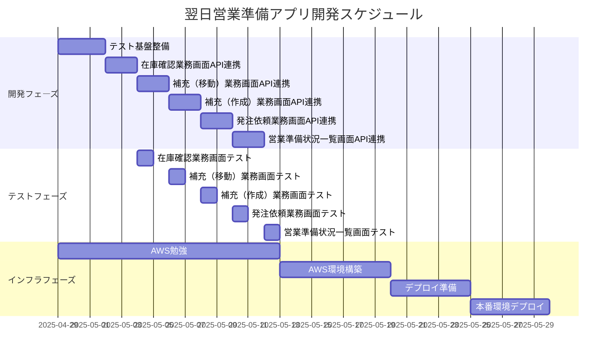
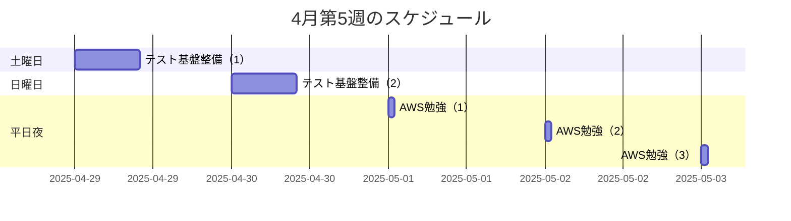

# プロジェクトスケジュール

## プロジェクト概要
- 目標：2025年6月30日までにアプリケーションを完成させ、AWSにデプロイ
- 開発環境：PostgreSQL、Java、Vue.js、Vitest
- 開発体制：個人開発（AIとの共同開発）
- 作業時間：週末1日10時間、平日週5時間程度
- 認証：Google認証（Gmailアカウント）

## 現状
- 要件はほぼ固まっている
- DBは先に用意済み
- 各画面の実装を進めている段階
- インフラは未経験、AWSの勉強が必要

## WBS（Work Breakdown Structure）

## マイルストーン
1. 開発完了：2025年6月中旬
2. テスト完了：2025年6月下旬
3. デプロイ完了：2025年6月30日

## 週次スケジュール（例：4月第5週）

## リスク管理
1. スケジュールリスク
   - 限られた作業時間による進捗遅延
   - 対応策：優先度の高いタスクから着手、AIの活用

2. 技術リスク
   - AWSデプロイの経験不足
   - 対応策：早めにAWSの勉強を開始、段階的な環境構築

3. 品質リスク
   - テスト時間の不足
   - 対応策：開発と並行してテストを実施、Vitestの活用

## 進捗管理方法
1. 週次進捗報告
   - 毎週日曜日に進捗状況を確認
   - タスクの完了状況を更新
   - 次の週の計画を立てる

2. 日次進捗管理
   - 作業開始時に当日の目標を設定
   - 作業終了時に進捗を記録
   - 課題や懸念事項を共有

## 開発方針
1. 最小限のAWSコスト
   - 必要最小限のリソースで構成
   - 無料枠の活用
   - コスト監視の徹底

2. シンプルな認証
   - Google認証のみ実装
   - ユーザーフレンドリーなUI

3. テスト戦略
   - Vitestを使用した単体テスト
   - 開発と並行したテスト実施
   - 自動テストの活用 