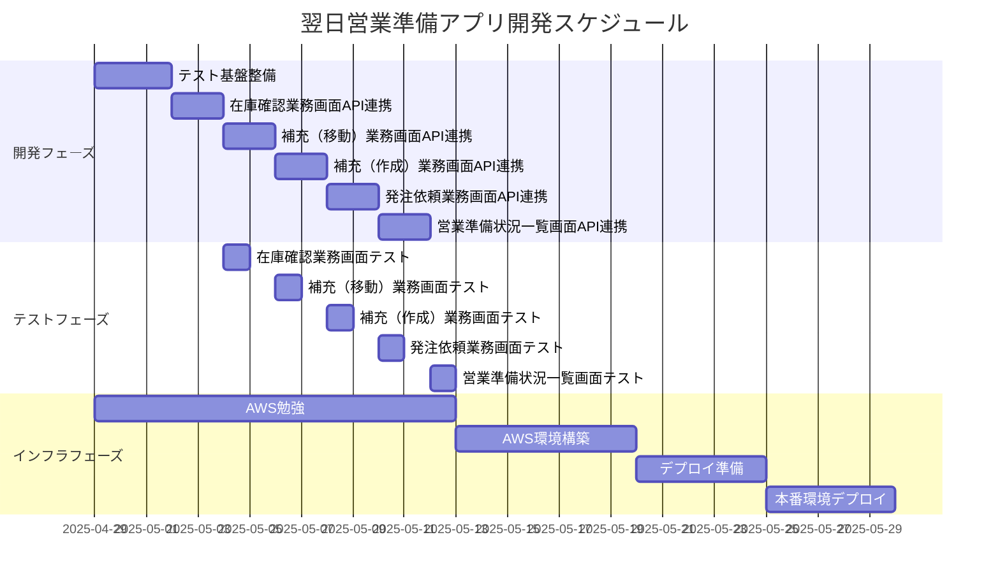

# タスク詳細分解と進捗管理

## WBS（Work Breakdown Structure）

## 1. 設計フェーズ

### 1.1 要件定義の詳細
- [x] 現行の要件ドキュメントの精査
  - [x] アプリケーション概念設計ノート.mdの記載
- [x] 各画面の要件詳細化
  - [x] トップページ
  - [x] 在庫確認業務画面
  - [x] 補充（移動）業務画面
  - [x] 補充（作成）業務画面
  - [x] 発注依頼業務画面
  - [x] 営業準備状況一覧画面
- [ ] 非機能要件の定義
  - [ ] パフォーマンス要件
  - [ ] セキュリティ要件
  - [ ] 運用要件

### 1.2 画面設計の詳細化
- [x] トップページ
  - [x] 画面遷移図
  - [x] ワイヤーフレーム
  - [x] UIコンポーネント
  - [x] レスポンシブデザイン
- [ ] 共通コンポーネント
  - [x] ヘッダー
  - [x] サイドメニュー
- [ ] 在庫確認業務画面
  - [ ] 画面遷移図
  - [ ] ワイヤーフレーム
  - [ ] UIコンポーネント
  - [ ] レスポンシブデザイン
- [ ] 補充（移動）業務画面
  - [ ] 画面遷移図
  - [ ] ワイヤーフレーム
  - [ ] UIコンポーネント
  - [ ] レスポンシブデザイン
- [ ] 補充（作成）業務画面
  - [ ] 画面遷移図
  - [ ] ワイヤーフレーム
  - [ ] UIコンポーネント
  - [ ] レスポンシブデザイン
- [ ] 発注依頼業務画面
  - [ ] 画面遷移図
  - [ ] ワイヤーフレーム
  - [ ] UIコンポーネント
  - [ ] レスポンシブデザイン
- [ ] 営業準備状況一覧画面
  - [ ] 画面遷移図
  - [ ] ワイヤーフレーム
  - [ ] UIコンポーネント
  - [ ] レスポンシブデザイン

### 1.3 DB設計の詳細化
- [x] 予約関連
  - [x] エンティティ定義
  - [x] リレーション定義
- [ ] 在庫関連
  - [ ] エンティティ定義
  - [ ] リレーション定義
- [ ] 商品関連
  - [ ] エンティティ定義
  - [ ] リレーション定義
- [ ] 場所関連
  - [ ] エンティティ定義
  - [ ] リレーション定義

### 1.4 API設計の詳細化
- [x] 予約機能
  - [x] REST API仕様書
  - [x] エラーハンドリング
  - [x] 認証・認可
- [ ] 在庫確認機能
  - [ ] REST API仕様書
  - [ ] エラーハンドリング
  - [ ] 認証・認可
- [ ] 補充（移動）機能
  - [ ] REST API仕様書
  - [ ] エラーハンドリング
  - [ ] 認証・認可
- [ ] 補充（作成）機能
  - [ ] REST API仕様書
  - [ ] エラーハンドリング
  - [ ] 認証・認可
- [ ] 発注依頼機能
  - [ ] REST API仕様書
  - [ ] エラーハンドリング
  - [ ] 認証・認可
- [ ] 営業準備状況一覧機能
  - [ ] REST API仕様書
  - [ ] エラーハンドリング
  - [ ] 認証・認可

## 2. 開発フェーズ

### 1.1 共通基盤開発
- [x] プロジェクト設定
  - [x] フロントエンド環境構築
    - [x] Vue.js 3.x
    - [x] TypeScript
    - [x] Tailwind CSS
    - [x] Vite
    - [ ] Vitest
  - [x] バックエンド環境構築
    - [x] Java 17
    - [x] Spring Boot 3.x
    - [x] Spring Security
    - [x] JUnit 5
    - [x] PostgreSQL
- [x] 共通機能実装
  - [x] Google認証実装
  - [x] エラーハンドリング
  - [x] ログ機能
  - [x] ユーティリティクラス
  - [x] ラベル管理の一元化（labels.yml等の実装）
  - [x] UUIDの統一（v7の採用）
  - [x] MyBatisからJPAへの移行

### 1.2 トップページ開発
- [x] 基本レイアウト実装
  - [x] ヘッダーのメニュー名表示の修正
  - [x] 業務日付のUI改善
  - [x] 予約入力欄のUI改善
  - [x] プラスボタンの位置調整
  - [x] ゴミ箱アイコンの実装
  - [x] 各ページへのリンクリストの復活
  - [x] プラスボタンの色をプライマリカラー（#e07833）に変更
  - [x] 初期描画時の商品名と予約数の1件表示
  - [x] 予約入力欄の背景色のダークモード対応
- [x] 業務日付管理機能
- [x] 予約管理機能
- [x] 自動保存機能
  - [x] LocalStorageへの保存機能
  - [x] DBへの保存機能
  - [x] 入力欄からカーソルが外れたタイミングでの保存

### 1.3 在庫確認業務画面開発
- [x] 基本レイアウト実装
- [x] 補充先切り替え機能
- [x] 在庫確認ステータス管理
- [x] 補充ステータス管理
- [ ] メモ機能
- [ ] 自動保存機能
  - [ ] バックエンドとの通信の疎通確認（CRUDすべて）

### 1.4 補充（移動）業務画面開発
- [x] 基本レイアウト実装
- [ ] 補充元切り替え機能
- [ ] 補充ステータス管理
- [ ] 自動保存機能

### 1.5 補充（作成）業務画面開発
- [x] 基本レイアウト実装
- [ ] 作成ステータス管理
- [ ] 自動保存機能

### 1.6 発注依頼業務画面開発
- [x] 基本レイアウト実装
- [ ] 発注依頼ステータス管理
- [ ] 自動保存機能

### 1.7 営業準備状況一覧画面開発
- [x] 基本レイアウト実装
- [ ] 要対応品目絞り込み機能
- [ ] ステータス表示機能

## 2. テストフェーズ

### 2.1 単体テスト（Vitest）
- [ ] フロントエンド単体テスト
  - [ ] コンポーネントテスト
  - [ ] ユーティリティ関数テスト
  - [ ] ストアテスト
- [ ] バックエンド単体テスト
  - [ ] コントローラーテスト
  - [ ] サービステスト
  - [ ] リポジトリテスト
- [ ] テストカバレッジ測定

### 2.2 結合テスト
- [ ] API結合テスト
- [ ] 画面結合テスト
- [ ] データベース結合テスト

### 2.3 システムテスト
- [ ] 機能テスト
- [ ] 非機能テスト
- [ ] ユーザビリティテスト

## 3. インフラフェーズ

### 3.1 AWS勉強
- [ ] 基本概念の理解
- [ ] コスト最適化の学習
- [ ] セキュリティの学習
- [ ] モニタリングの学習

### 3.2 AWS環境構築
- [ ] VPC設計・構築
- [ ] セキュリティグループ設定
- [ ] RDS設定
- [ ] ECS設定
- [ ] S3設定

### 3.3 デプロイ準備
- [ ] デプロイスクリプト作成
- [ ] 環境変数設定
- [ ] バックアップ設定

### 3.4 本番環境デプロイ
- [ ] ステージング環境デプロイ
- [ ] 本番環境デプロイ
- [ ] 動作確認
- [ ] モニタリング設定

## 進捗管理表

| タスク | 開始日 | 完了日 | 進捗率 | 備考 |
|--------|--------|--------|--------|------|
| テスト基盤整備 | 2025-04-29 | - | 0% | Vitestの導入とテストコード実装 |
| 在庫確認業務画面API連携 | 2025-04-29 | - | 60% | 基本レイアウト、画面切り替え、ステータス管理は完了、API連携と自動保存機能が残り |
| 補充（移動）業務画面API連携 | - | - | 0% | 基本レイアウトは完了、API連携が残り |
| 補充（作成）業務画面API連携 | - | - | 0% | 基本レイアウトは完了、API連携が残り |
| 発注依頼業務画面API連携 | - | - | 0% | 基本レイアウトは完了、API連携が残り |
| 営業準備状況一覧画面API連携 | - | - | 0% | 基本レイアウトは完了、API連携が残り |
| 在庫確認業務画面テスト | - | - | 0% | 未着手 |
| 補充（移動）業務画面テスト | - | - | 0% | 未着手 |
| 補充（作成）業務画面テスト | - | - | 0% | 未着手 |
| 発注依頼業務画面テスト | - | - | 0% | 未着手 |
| 営業準備状況一覧画面テスト | - | - | 0% | 未着手 |
| AWS勉強 | 2025-04-29 | - | 0% | 開始予定 |
| AWS環境構築 | - | - | 0% | 未着手 |
| デプロイ準備 | - | - | 0% | 未着手 |
| 本番環境デプロイ | - | - | 0% | 未着手 |

## 週次開発計画

### 2025年4月第5週（4/29-5/3）
- 作業時間：約15時間
  - 平日（4/29-5/3）：10時間
  - 土日（5/4-5/5）：5時間
- 目標
  - テスト基盤の整備（7時間）
    - Vitestの導入
    - テスト環境の構築
    - 既存コンポーネントのテスト実装
  - 在庫確認業務画面のAPI連携完了（残り5時間）
- 実績
  - テスト基盤整備：0%
  - 在庫確認業務画面API連携：60%

### 2025年5月第1週（5/6-5/10）
- 作業時間：約20時間
  - 平日：10時間
  - 土日：10時間
- 目標
  - 在庫確認業務画面のAPI連携完了（5時間）
  - 在庫確認業務画面のテスト完了（5時間）
  - 補充（移動）業務画面のAPI連携完了（10時間）
- 実績
  - 在庫確認業務画面API連携：100%
  - 在庫確認業務画面テスト：50%
  - 補充（移動）業務画面API連携：50%

### 2025年5月第2週（5/13-5/17）
- 作業時間：約20時間
  - 平日：10時間
  - 土日：10時間
- 目標
  - 補充（移動）業務画面のAPI連携完了（5時間）
  - 補充（移動）業務画面のテスト完了（5時間）
  - 補充（作成）業務画面のAPI連携完了（10時間）
- 実績
  - 補充（移動）業務画面API連携：100%
  - 補充（移動）業務画面テスト：100%
  - 補充（作成）業務画面API連携：50%

### 2025年5月第3週（5/20-5/24）
- 作業時間：約20時間
  - 平日：10時間
  - 土日：10時間
- 目標
  - 補充（作成）業務画面のAPI連携完了（5時間）
  - 補充（作成）業務画面のテスト完了（5時間）
  - 発注依頼業務画面のAPI連携完了（10時間）
- 実績
  - 補充（作成）業務画面API連携：100%
  - 補充（作成）業務画面テスト：100%
  - 発注依頼業務画面API連携：50%

### 2025年5月第4週（5/27-5/31）
- 作業時間：約20時間
  - 平日：10時間
  - 土日：10時間
- 目標
  - 発注依頼業務画面のAPI連携完了（5時間）
  - 発注依頼業務画面のテスト完了（5時間）
  - 営業準備状況一覧画面のAPI連携完了（10時間）
- 実績
  - 発注依頼業務画面API連携：100%
  - 発注依頼業務画面テスト：100%
  - 営業準備状況一覧画面API連携：50%

### 2025年6月第1週（6/3-6/7）
- 作業時間：約20時間
  - 平日：10時間
  - 土日：10時間
- 目標
  - 営業準備状況一覧画面のAPI連携完了（5時間）
  - 営業準備状況一覧画面のテスト完了（5時間）
  - AWS環境構築の開始（10時間）
- 実績
  - 営業準備状況一覧画面API連携：100%
  - 営業準備状況一覧画面テスト：100%
  - AWS環境構築：0%

### 2025年6月第2週（6/10-6/14）
- 作業時間：約20時間
  - 平日：10時間
  - 土日：10時間
- 目標
  - AWS環境構築の完了（20時間）
- 実績
  - AWS環境構築：100%

### 2025年6月第3週（6/17-6/21）
- 作業時間：約20時間
  - 平日：10時間
  - 土日：10時間
- 目標
  - デプロイ準備の完了（20時間）
- 実績
  - デプロイ準備：100%

### 2025年6月第4週（6/24-6/28）
- 作業時間：約20時間
  - 平日：10時間
  - 土日：10時間
- 目標
  - 本番環境デプロイの完了（20時間）
- 実績
  - 本番環境デプロイ：100%

 