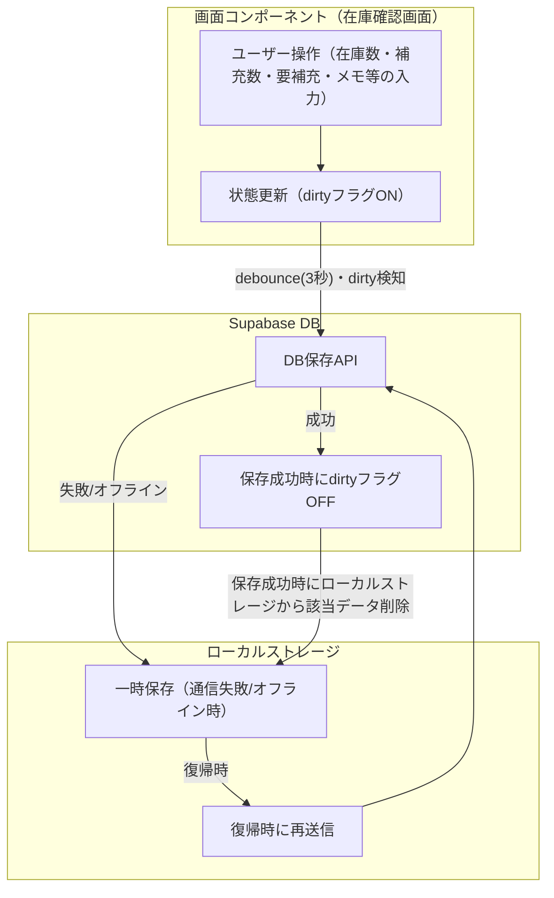

# 在庫確認画面 自動保存設計方針

## 1. 自動保存の基本方針
- 保存ボタンは設けず、ユーザーの入力・操作内容は裏で自動保存する
- 入力・操作ごとに即時DB保存は行わず、**debounce（3秒）**でまとめて保存
- 変更があったitemのみ「dirty」フラグを立て、**dirtyなitemだけ差分検知して保存**
- 同じ内容の重複保存は行わない

## 2. 保存処理の流れ
1. ユーザーが在庫数・補充数・要補充・メモ・確認済などを入力/操作
2. 対象itemにdirtyフラグを立てる
3. debounce（3秒）タイマーが発火したタイミングで、dirtyなitemだけ「前回保存内容」と比較
4. 差分があればDB（Supabase）へ保存APIを呼ぶ
5. 保存成功時にdirtyフラグをクリアし、「前回保存内容」を更新
6. 通信失敗時やオフライン時はローカルストレージに一時保存し、復帰時に再送信

## 3. ローカルストレージの役割
- 通信失敗時やオフライン時の「保険」として、入力内容を一時保存
- DB保存成功時に該当データを削除
- 復帰時にローカルストレージから未保存データを再送信

## 4. スケーラビリティ・無料枠検証
- Supabase無料枠（2024年6月時点）
  - APIリクエスト数：無制限（Unlimited API requests）
  - DBサイズ：500MB
  - 帯域：5GB/月
- 現状のテーブル設計・業務規模（item数100、10年運用）でも100MB未満で十分余裕あり
- 通信量・リクエスト数もdebounce＋差分保存で最小化し、無料枠を超えない運用が可能
- 画像や大容量ファイルを保存しない限り、ストレージ圧迫の心配は小さい

## 5. 運用上の注意
- Supabase管理画面でDBサイズ・帯域・リクエスト数を定期的にモニタリング
- 不要なデータやテストデータは定期的に削除
- 仕様変更時は本ドキュメントも必ず更新

## 6. DB・ローカルストレージ・画面コンポーネントの関係図



## 7. AutoSaveManagerの使用方法

### 7.1 基本的な使用方法
```typescript
import { AutoSaveManager } from '@/lib/utils/auto-save-utils';

// AutoSaveManagerのインスタンスを作成
const autoSave = new AutoSaveManager({
  // 現在のデータを取得する関数
  getData: () => ({
    items: inventoryItems,
    lastChecked: new Date().toISOString(),
  }),
  // データを保存する関数
  saveData: async (data) => {
    await dbService.inventory.saveInventoryCheck(data);
  },
  // ローカルストレージのキー
  storageKey: 'inventory_checks_autosave',
});

// データが変更された時の処理
const handleDataChange = () => {
  // 変更を検知して自動保存を開始
  autoSave.markDirty();
};

// オフライン復帰時の処理
useEffect(() => {
  const handleOnline = () => {
    // オフライン中に保存できなかったデータを再送信
    autoSave.retryFailedSaves();
  };

  window.addEventListener('online', handleOnline);
  return () => window.removeEventListener('online', handleOnline);
}, []);
```

### 7.2 主な機能
- `markDirty()`: データの変更を検知し、自動保存を開始
- `retryFailedSaves()`: オフライン中に保存できなかったデータを再送信
- `hasChanges()`: 変更状態の確認
- `getLastSavedData()`: 前回保存時の内容を取得

### 7.3 使用上の注意点
- `getData`関数は常に最新のデータを返す必要がある
- `saveData`関数は非同期で、Promiseを返す必要がある
- `storageKey`は一意の値を指定する必要がある
- オフライン時の再送信のために、オンラインイベントのリスナーを設定することを推奨

---

（本ドキュメントは今後の運用・設計方針の合意形成・引き継ぎのための公式記録とする） 