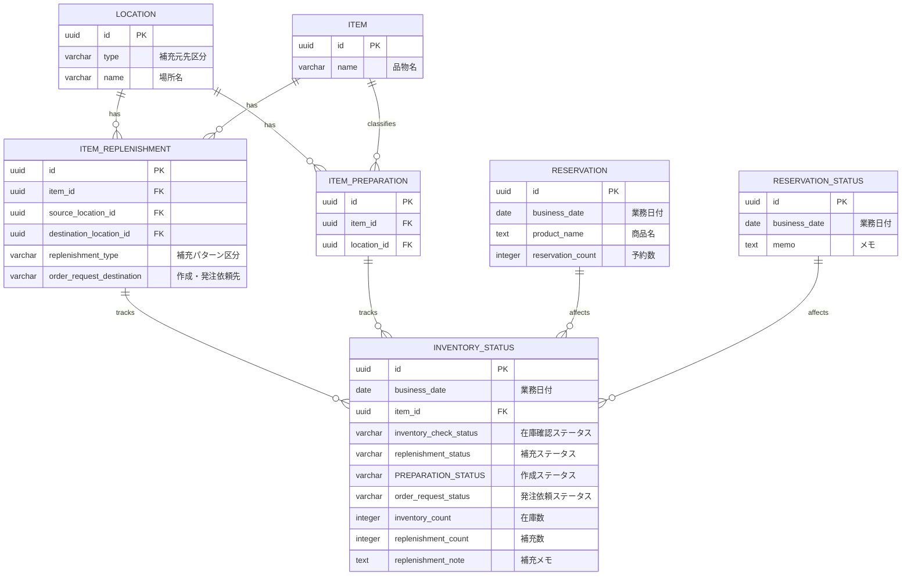

# データベーススキーマ定義

## ER図

## テーブル定義

### 場所マスタ (LOCATION)
| カラム名 | データ型 | 制約 | 説明 |
|----------|----------|------|------|
| id | uuid | PK | 場所ID |
| type | varchar | NOT NULL | 補充元先区分 |
| name | varchar | NOT NULL | 場所名 |

### 品物マスタ (ITEM)
| カラム名 | データ型 | 制約 | 説明 |
|----------|----------|------|------|
| id | uuid | PK | 品物ID |
| name | varchar | NOT NULL | 品物名 |

### 品物別前日営業準備マスタ (ITEM_REPLENISHMENT)
| カラム名 | データ型 | 制約 | 説明 |
|----------|----------|------|------|
| id | uuid | PK | ID |
| item_id | uuid | FK | 品物ID |
| source_location_id | uuid | FK | 補充元場所ID |
| destination_location_id | uuid | FK | 補充先場所ID |
| replenishment_type | varchar | NOT NULL | 補充パターン区分 |
| order_request_destination | varchar | | 作成・発注依頼先 |

### 在庫補充状況管理トラン (INVENTORY_STATUS)
| カラム名 | データ型 | 制約 | 説明 |
|----------|----------|------|------|
| id | uuid | PK | ID |
| business_date | date | NOT NULL | 業務日付 |
| item_id | uuid | FK | 品物ID |
| inventory_check_status | varchar | NOT NULL | 在庫確認ステータス |
| replenishment_status | varchar | NOT NULL | 補充ステータス |
| PREPARATION_STATUS | varchar | NOT NULL | 作成ステータス |
| order_request_status | varchar | NOT NULL | 発注依頼ステータス |
| inventory_count | integer | | 在庫数 |
| replenishment_count | integer | | 補充数 |
| replenishment_note | text | | 補充メモ |

### 商品予約トラン (RESERVATION)
| カラム名 | データ型 | 制約 | 説明 |
|----------|----------|------|------|
| id | uuid | PK | ID |
| business_date | date | NOT NULL | 業務日付 |
| product_name | text | NOT NULL | 商品名 |
| reservation_count | integer | NOT NULL | 予約数 |

### 予約状況トラン (RESERVATION_STATUS)
| カラム名 | データ型 | 制約 | 説明 |
|----------|----------|------|------|
| id | uuid | PK | ID |
| business_date | date | NOT NULL | 業務日付 |
| memo | text | | メモ |

## 区分値定義

### 補充元先区分 (LOCATION.type)
- 補充元
- 補充先

### 補充パターン区分 (ITEM_REPLENISHMENT.replenishment_type)
- 移動
- 作成

### 在庫確認ステータス (INVENTORY_STATUS.inventory_check_status)
- 未確認
- 確認中
- 確認済
- 確認不要

### 補充ステータス (INVENTORY_STATUS.replenishment_status)
- 補充不要
- 要補充
- 補充済

### 作成ステータス (INVENTORY_STATUS.PREPARATION_STATUS)
- 作成不要
- 要作成
- 作成済
- 作成依頼済

### 発注依頼ステータス (INVENTORY_STATUS.order_request_status)
- 発注不要
- 要発注依頼
- 発注依頼済 