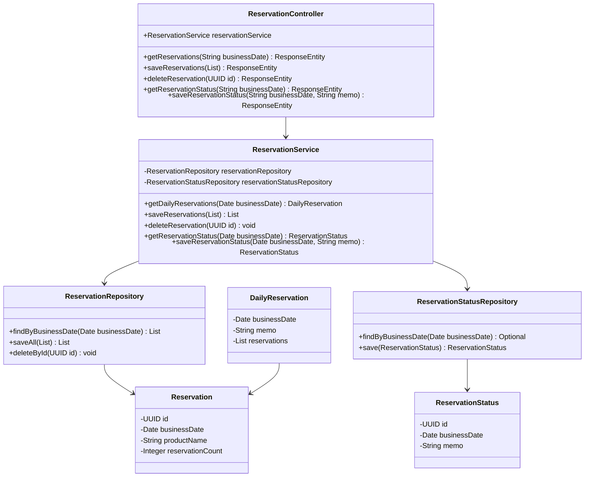
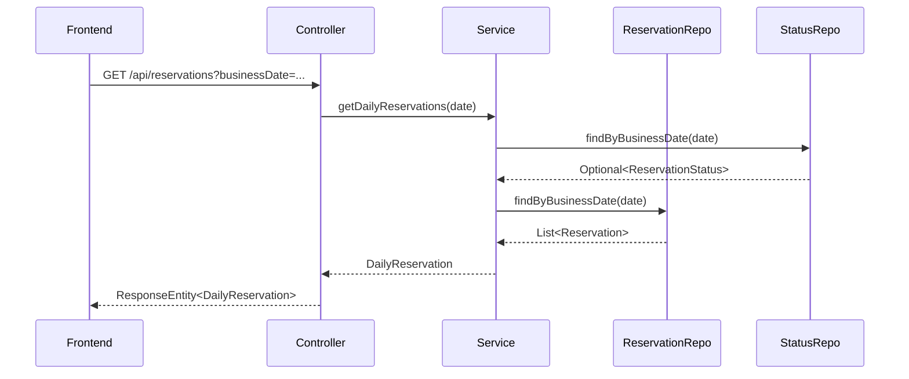
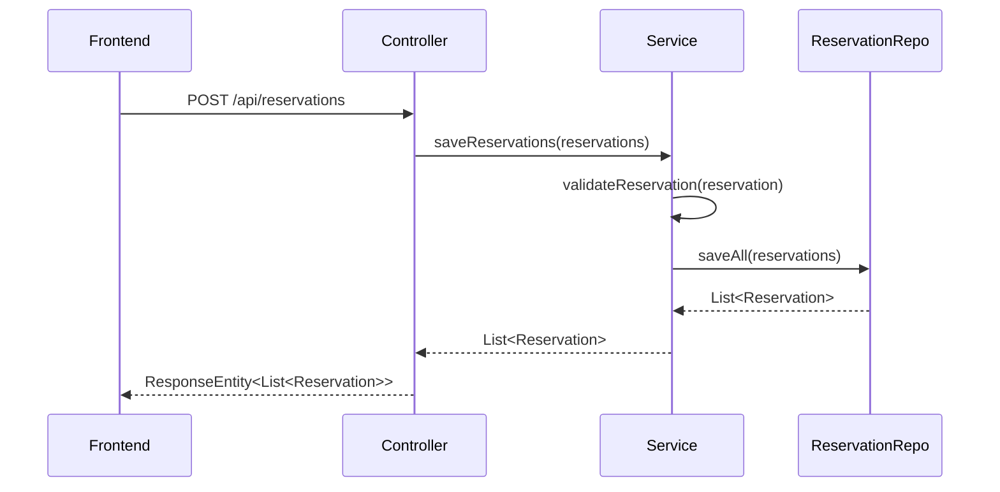

# 予約機能設計書

## 1. 機能概要
予約機能は、翌日の営業準備に関する予約情報を管理する機能です。業務日付ごとに予約情報とメモを管理します。

## 2. クラス構成

### 2.1 クラス図

### 2.2 シーケンス図（予約情報取得）

### 2.3 シーケンス図（予約情報保存）

### 2.1 エンティティ
#### Reservation
- 予約情報を管理するエンティティ
- 業務日付、商品名、予約数を保持
- バリデーション
  - 業務日付: 必須
  - 商品名: 必須
  - 予約数: 必須、1以上

#### ReservationStatus
- 予約状況を管理するエンティティ
- 業務日付、メモを保持

### 2.2 DTO
#### DailyReservation
- 1日分の予約情報をまとめて管理するDTO
- 業務日付、メモ、予約リストを保持

### 2.3 コントローラー
#### ReservationController
- エンドポイント
  - GET `/api/reservations`: 予約情報の取得
  - POST `/api/reservations`: 予約情報の保存
  - DELETE `/api/reservations`: 予約情報の削除
  - GET `/api/reservations/status`: 予約状況の取得
  - POST `/api/reservations/status`: 予約状況の保存

### 2.4 サービス
#### ReservationService
- 主な機能
  - 予約情報の取得・保存・削除
  - 予約状況の取得・保存
  - バリデーション
  - トランザクション管理

### 2.5 リポジトリ
#### ReservationRepository
- 予約情報の永続化処理

#### ReservationStatusRepository
- 予約状況の永続化処理

## 3. データフロー
1. フロントエンドから業務日付を指定して予約情報を取得
2. 予約情報の追加・更新・削除
3. 予約状況（メモ）の更新
4. データベースへの永続化

## 4. エラーハンドリング
- バリデーションエラー
- データベース整合性エラー
- 予期せぬエラー
- エラーメッセージの多言語対応

## 5. トランザクション管理
- 予約情報の保存・更新・削除はトランザクション内で実行
- 読み取り専用トランザクションの適切な使用

## 6. バリデーション
- エンティティレベルでのバリデーション
- サービス層でのビジネスロジックバリデーション
- カスタムバリデーションルール

## 7. 関連ドキュメント
- [フロントエンド予約機能設計書](../frontend/screens/top_page_design.md)
- [アプリケーション全体の設計](../アプリケーション概念設計ノート.md) 