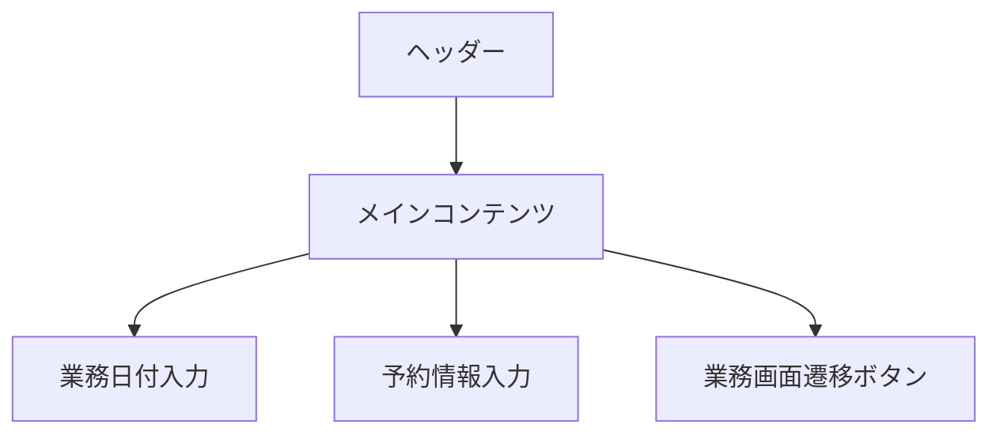

# トップページ設計書

## 1. 画面概要

トップページは、翌日の営業準備に関する予約情報の管理と、各業務画面への遷移を提供する画面です。

## 2. 画面レイアウト

## 2. 画面項目定義

### 2.1 業務日付入力

- 入力フィールド
  - ラベル: "業務日付"
  - 型: 日付型
  - 初期値: 当日
  - 必須: はい
  - 自動保存: あり
  - 日付選択: カレンダーUI

### 2.2 予約情報入力

- 商品名入力フィールド
  - ラベル: "商品名"
  - 型: テキスト
  - 必須: はい
  - 自動保存: あり
- 予約数入力フィールド
  - ラベル: "予約数"
  - 型: 数値
  - 必須: はい
  - 自動保存: あり
- 追加ボタン
  - アイコン: プラス
  - 色: プライマリカラー (#e07833)
- 削除ボタン
  - アイコン: ゴミ箱
  - 各予約情報行に配置

### 2.3 メモ入力

- 入力フィールド
  - ラベル: "メモ"
  - 型: テキストエリア
  - 行数: 3行
  - 自動保存: あり

## 3. 画面遷移

- [在庫確認業務](inventory_confirmation_design.md)画面遷移ボタン
- [補充（移動）業務](restocking_move_design.md)画面遷移ボタン
- [補充（作成）業務](restocking_create_design.md)画面遷移ボタン
- [発注依頼業務](order_request_design.md)画面遷移ボタン
- [営業準備状況一覧](sales_preparation_design.md)画面遷移ボタン

## 4. 自動保存機能

- 保存タイミング
  1. 入力欄からカーソルが外れた時
  2. 一定時間（5秒）入力がない時
  3. より長い間隔（30秒）での自動保存
- 保存先
  1. LocalStorage
  2. データベース

## 5. レスポンシブ対応

- スマートフォンでの片手操作に最適化
- スクロール不要な設計
- タッチ操作に適したボタンサイズ

## 6. ダークモード対応

- 入力欄の背景色
- テキストの色
- ボタンの色

## 7. エラーハンドリング

- 入力値のバリデーション
- 保存失敗時のエラーメッセージ表示
- ネットワークエラー時のリトライ処理

## 8. 関連ドキュメント

- [共通ヘッダーの設計](header_design.md)
- [共通サイドメニューの設計](side_menu_design.md)
- [アプリケーション全体の設計](../アプリケーション概念設計ノート.md)
