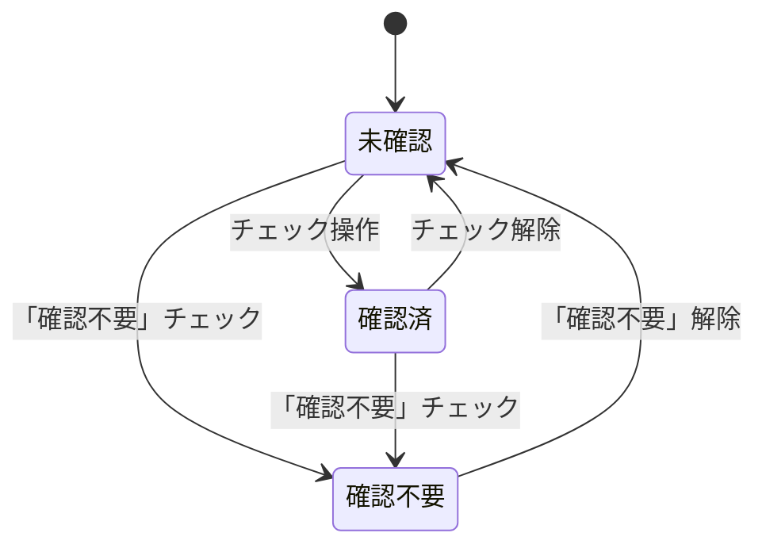
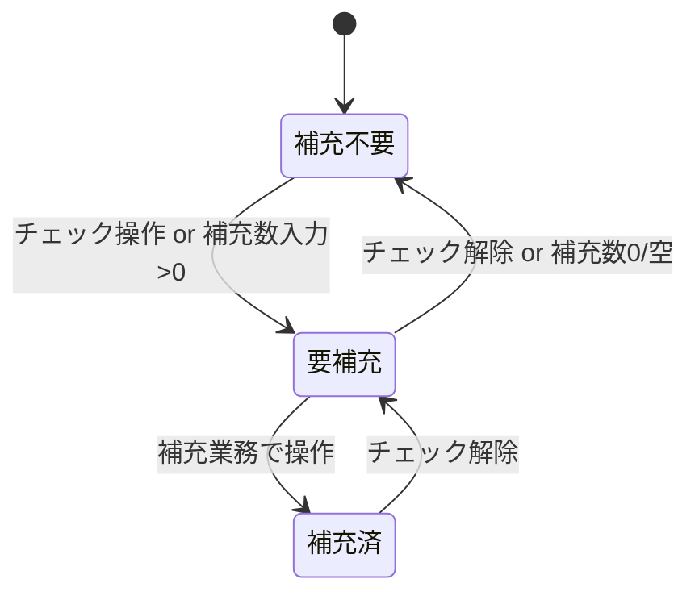
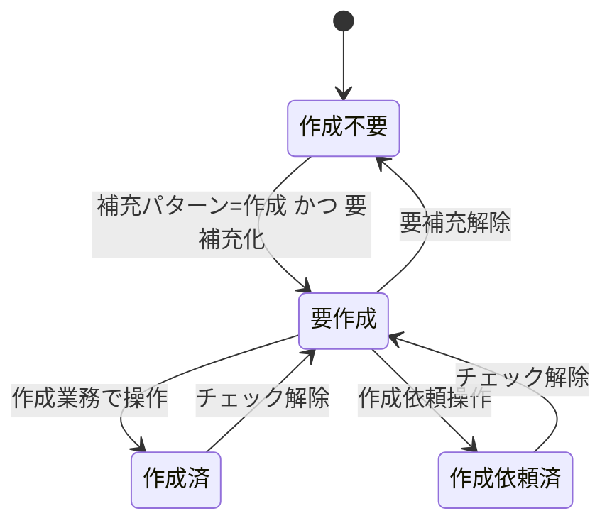
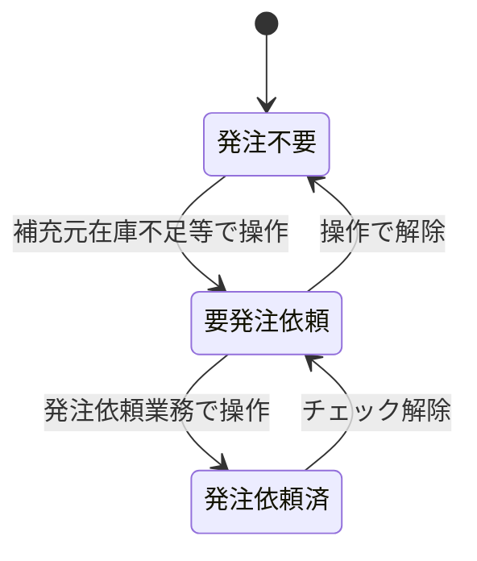
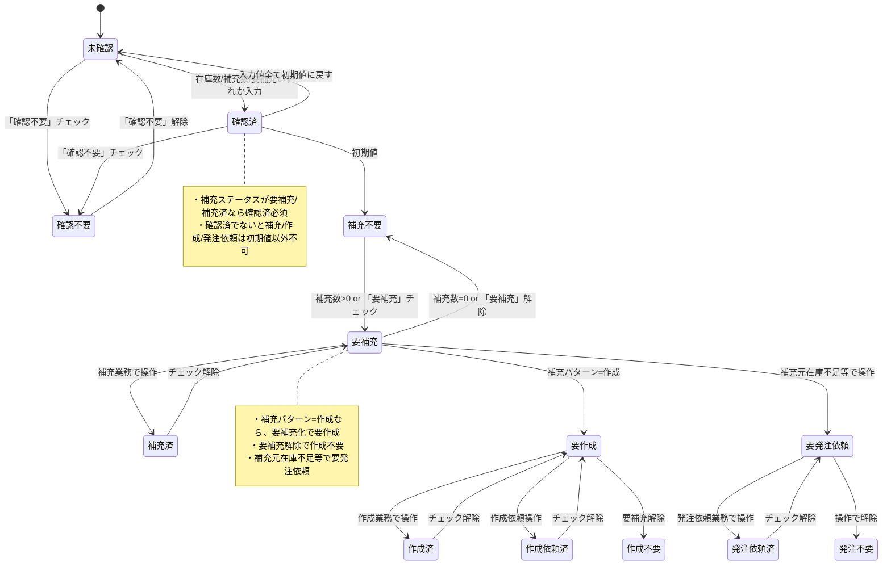

# 在庫確認画面 ステータス遷移図

本資料は「アプリケーション概念設計ノート.md」の区分値定義・業務フローに基づき、在庫確認画面で扱う各種ステータスの状態遷移をMermaid記法で図示したものです。

---

## 1. 在庫確認ステータス 状態遷移図

---

## 2. 補充ステータス 状態遷移図

---

## 3. 作成ステータス 状態遷移図

---

## 4. 発注依頼ステータス 状態遷移図

---

※各状態遷移のトリガーは業務フロー・画面操作に準拠。詳細は「アプリケーション概念設計ノート.md」を参照。 

