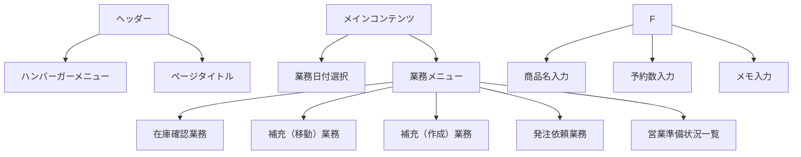
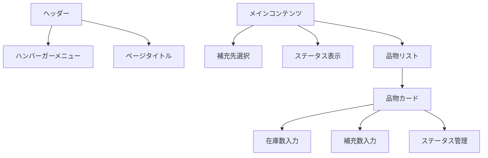
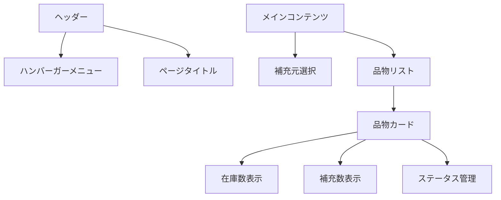
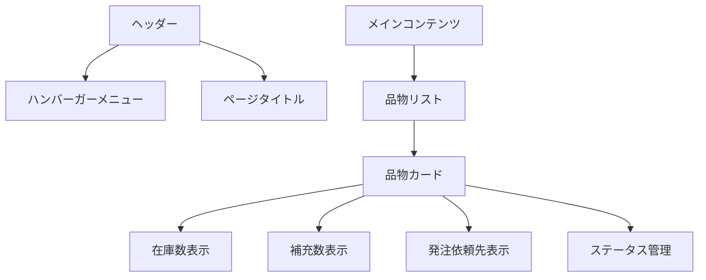
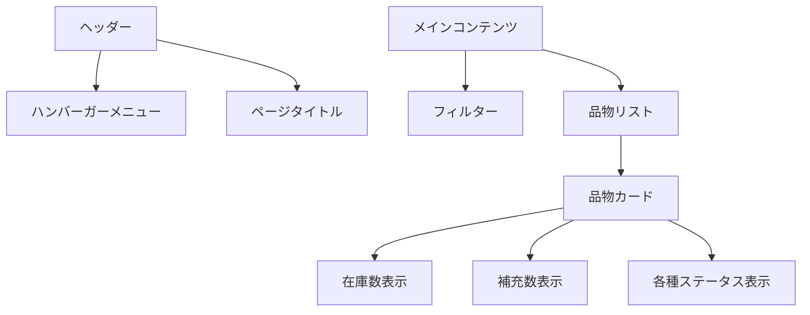

# 画面設計書（2025年5月移行対応）

## 画面一覧
1. トップページ
2. 在庫確認業務画面
3. 補充（移動）業務画面
4. 補充（作成）業務画面
5. 発注依頼業務画面
6. 営業準備状況一覧画面

---

## 画面詳細

### 1. トップページ
#### 画面概要
- 業務日付の設定と各業務画面への遷移を提供
- 翌日の営業に関する予約情報の入力が可能
- 入力データの自動保存機能を提供

#### 画面レイアウト

#### 画面項目
| 項目名 | タイプ | 必須 | 説明 |
|--------|--------|------|------|
| 業務日付 | 日付選択 | ○ | デフォルトは当日 |
| 商品名 | テキスト入力 | ○ | 予約商品の名称 |
| 予約数 | 数値入力 | ○ | 予約数量 |
| メモ | テキストエリア | - | 予約に関するメモ |
| 在庫確認業務 | ボタン | - | 在庫確認業務画面へ遷移 |
| 補充（移動）業務 | ボタン | - | 補充（移動）業務画面へ遷移 |
| 補充（作成）業務 | ボタン | - | 補充（作成）業務画面へ遷移 |
| 発注依頼業務 | ボタン | - | 発注依頼業務画面へ遷移 |
| 営業準備状況一覧 | ボタン | - | 営業準備状況一覧画面へ遷移 |

#### 自動保存機能
- フォーカスが外れた時点で自動保存
- 30秒間隔での定期的な自動保存
- ローカルストレージを使用した一時保存
- バックエンドへの非同期保存

### 2. 在庫確認業務画面

#### 画面概要
- 補充先ごとの在庫確認と補充数の入力
- 在庫確認ステータスと補充ステータスの管理

#### 画面レイアウト

#### 画面項目
| 項目名 | タイプ | 必須 | 説明 |
|--------|--------|------|------|
| 補充先 | プルダウン | ○ | 補充先の選択 |
| 未確認件数 | バッジ | - | 未確認の品物数 |
| 確認済件数 | バッジ | - | 確認済の品物数 |
| 確認不要件数 | バッジ | - | 確認不要の品物数 |
| 品物名 | テキスト | - | 品物の名称 |
| 在庫数 | 数値入力 | - | 現在の在庫数 |
| 補充数 | 数値入力 | - | 補充が必要な数 |
| 在庫確認ステータス | チェックボックス | - | 未確認/確認済 |
| 確認不要 | チェックボックス | - | 在庫確認が不要な場合 |
| 補充ステータス | チェックボックス | - | 補充不要/要補充 |

#### 操作フロー
1. 補充先を選択
2. 品物リストが表示される
3. 各品物の在庫数を確認し入力
4. 補充が必要な場合は補充数を入力
5. 在庫確認ステータスを更新
6. 確認不要な場合はチェックを入れる

### 3. 補充（移動）業務画面

#### 画面概要
- 補充元ごとの補充作業の管理
- 補充ステータスの更新

#### 画面レイアウト

#### 画面項目
| 項目名 | タイプ | 必須 | 説明 |
|--------|--------|------|------|
| 補充元 | プルダウン | ○ | 補充元の選択 |
| 品物名 | テキスト | - | 品物の名称 |
| 在庫数 | テキスト | - | 現在の在庫数（表示のみ） |
| 補充数 | テキスト | - | 補充が必要な数（表示のみ） |
| 補充ステータス | チェックボックス | - | 要補充/補充済 |
| 補充メモ | テキストエリア | - | 補充に関するメモ |

#### 操作フロー
1. 補充元を選択
2. 要補充の品物リストが表示される
3. 補充作業を実施
4. 補充完了後、ステータスを更新
5. 必要に応じてメモを入力

### 4. 補充（作成）業務画面

#### 画面概要
- 作成が必要な品物の管理
- 作成ステータスの更新

#### 画面レイアウト

#### 画面項目
| 項目名 | タイプ | 必須 | 説明 |
|--------|--------|------|------|
| 品物名 | テキスト | - | 品物の名称 |
| 在庫数 | テキスト | - | 現在の在庫数（表示のみ） |
| 補充数 | テキスト | - | 補充が必要な数（表示のみ） |
| 作成依頼先 | テキスト | - | 作成を依頼する先 |
| 作成ステータス | ラジオボタン | - | 要作成/作成済/作成依頼済 |

#### 操作フロー
1. 要作成の品物リストが表示される
2. 作成作業を実施または依頼
3. ステータスを更新

### 5. 発注依頼業務画面

#### 画面概要
- 発注が必要な品物の管理
- 発注依頼ステータスの更新

#### 画面レイアウト

#### 画面項目
| 項目名 | タイプ | 必須 | 説明 |
|--------|--------|------|------|
| 品物名 | テキスト | - | 品物の名称 |
| 在庫数 | テキスト | - | 現在の在庫数（表示のみ） |
| 補充数 | テキスト | - | 補充が必要な数（表示のみ） |
| 発注依頼先 | テキスト | - | 発注を依頼する先 |
| 発注依頼ステータス | ラジオボタン | - | 要発注依頼/発注依頼済 |

#### 操作フロー
1. 要発注依頼の品物リストが表示される
2. 発注依頼を実施
3. ステータスを更新

### 6. 営業準備状況一覧画面

#### 画面概要
- 全品物の営業準備状況の一覧表示
- 要対応品目のフィルタリング

#### 画面レイアウト

#### 画面項目
| 項目名 | タイプ | 必須 | 説明 |
|--------|--------|------|------|
| 要対応のみ表示 | チェックボックス | - | 要対応品目のみを表示 |
| 品物名 | テキスト | - | 品物の名称 |
| 在庫数 | テキスト | - | 現在の在庫数 |
| 補充数 | テキスト | - | 補充が必要な数 |
| 在庫確認ステータス | バッジ | - | 在庫確認の状態 |
| 補充ステータス | バッジ | - | 補充の状態 |
| 作成ステータス | バッジ | - | 作成の状態 |
| 発注依頼ステータス | バッジ | - | 発注依頼の状態 |

#### 操作フロー
1. 要対応のみ表示の切り替え
2. 各品物の状況を確認
3. 必要に応じて各業務画面へ遷移 