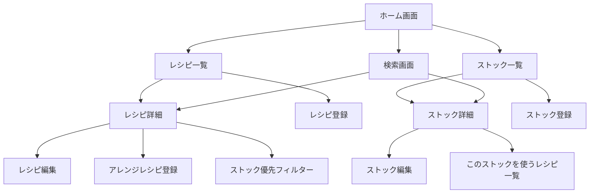

# 画面設計書

## デザイン方針

### 基本方針

- **Obsidian/shadcn/uiスタイル**: Obsidianのミニマルなデザインとshadcn/uiのモダンなコンポーネント設計を参考
- **ダークモードを基本とする**: 白黒に寄せたダークモードを基本デザインとする
- **機能性重視**: 余計な装飾を排除し、機能性を最優先
- **モバイルファースト**: レスポンシブデザインで、モバイルを優先して設計
- **シンプルで直感的**: 直感的な操作、明確な階層構造

### カラーパレット（Obsidian/shadcn/uiスタイル）

**基本カラー:**
- **背景色（メイン）**: `#0D1117`（Obsidian風のダークグレー）
- **背景色（セカンダリ）**: `#161B22`（やや明るいグレー）
- **背景色（カード/ホバー）**: `#21262D`（カードやホバー時の背景）
- **背景色（アクティブ）**: `#30363D`（選択時やアクティブな要素）
- **テキスト（プライマリ）**: `#C9D1D9`（Obsidian風のライトグレー）
- **テキスト（セカンダリ）**: `#8B949E`（ミディアムグレー）
- **テキスト（テルティアリ）**: `#6E7681`（薄いグレー）

**アクセントカラー（紺と青）:**
- **プライマリ**: `#58A6FF`（明るい青、Obsidian風のブルー）
- **プライマリ（ホバー）**: `#79C0FF`（より明るい青）
- **セカンダリ**: `#1F6FEB`（紺、インディゴブルー）
- **セカンダリ（ホバー）**: `#388BFD`（やや明るい紺）
- **成功**: `#3FB950`（緑）
- **警告**: `#D29922`（黄色）
- **エラー**: `#F85149`（レッド）

**ボーダー・区切り線:**
- **ボーダー**: `#30363D`（薄いグレー）
- **ボーダー（ホバー）**: `#484F58`（やや明るいグレー）
- **区切り線**: `#21262D`（セクション区切り）

### タイポグラフィ（Obsidian/shadcn/uiスタイル）

- **フォントファミリー**: システムフォント（`-apple-system, BlinkMacSystemFont, "Segoe UI", Roboto, "Helvetica Neue", Arial, sans-serif`）
- **見出し（H1）**: 32px / 1.25（太字、`font-weight: 600`）
- **見出し（H2）**: 24px / 1.3（太字、`font-weight: 600`）
- **見出し（H3）**: 20px / 1.4（太字、`font-weight: 600`）
- **見出し（H4）**: 18px / 1.4（太字、`font-weight: 600`）
- **本文**: 16px / 1.5（通常、`font-weight: 400`）
- **キャプション**: 14px / 1.5（通常、`font-weight: 400`）
- **小さなテキスト**: 12px / 1.5（通常、`font-weight: 400`）
- **コード**: `ui-monospace, SFMono-Regular, "SF Mono", Menlo, Consolas, "Liberation Mono", monospace`

### スペーシング（shadcn/uiスタイル）

- **ベースユニット**: 4px（Tailwind CSS準拠）
- **余白のバリエーション**: 4px, 8px, 12px, 16px, 20px, 24px, 32px, 40px, 48px, 64px
- **カードのパディング**: 16px（モバイル）、24px（デスクトップ）
- **コンテナの最大幅**: 1280px（デスクトップ）
- **コンテナのパディング**: 16px（モバイル）、24px（タブレット）、32px（デスクトップ）

### コンポーネント設計（shadcn/uiスタイル）

#### ボタン

**プライマリボタン（default）:**
- 背景色: プライマリカラー（`#58A6FF`）
- テキスト: 白（`#FFFFFF`）
- パディング: `h-10 px-4 py-2`（40px高さ、16px左右パディング）
- 角丸: `rounded-md`（6px）
- フォントサイズ: `text-sm`（14px）
- フォントウェイト: `font-medium`（500）
- ホバー: 背景色を`#79C0FF`に変更
- フォーカス: リング表示（`ring-2 ring-offset-2 ring-offset-background ring-ring`）

**セカンダリボタン（outline）:**
- 背景色: 透明
- ボーダー: `border border-input`（1px solid `#30363D`）
- テキスト: プライマリテキスト（`#C9D1D9`）
- パディング: `h-10 px-4 py-2`
- 角丸: `rounded-md`
- ホバー: 背景色を`#21262D`に変更、ボーダーを`#484F58`に変更

**ゴーストボタン（ghost）:**
- 背景色: 透明
- テキスト: プライマリテキスト（`#C9D1D9`）
- パディング: `h-10 px-4 py-2`
- 角丸: `rounded-md`
- ホバー: 背景色を`#21262D`に変更

**破壊的ボタン（destructive）:**
- 背景色: エラーカラー（`#F85149`）
- テキスト: 白（`#FFFFFF`）
- パディング: `h-10 px-4 py-2`
- 角丸: `rounded-md`
- ホバー: 背景色を`#DA3633`に変更

#### カード（shadcn/uiスタイル）

- 背景色: `#161B22`
- ボーダー: `border border-border`（1px solid `#30363D`）
- 角丸: `rounded-lg`（8px）
- パディング: `p-6`（24px）
- ホバー: ボーダーを`#484F58`に変更
- 影: なし（フラットデザイン）

#### 入力フィールド（shadcn/uiスタイル）

- 背景色: `#0D1117`
- ボーダー: `border border-input`（1px solid `#30363D`）
- テキスト: `#C9D1D9`
- パディング: `h-10 px-3 py-2`（40px高さ、12px左右パディング）
- 角丸: `rounded-md`（6px）
- フォントサイズ: `text-sm`（14px）
- フォーカス: ボーダーをプライマリカラー（`#58A6FF`）に変更、リング表示
- プレースホルダー: `#6E7681`
- 無効時: 背景色を`#161B22`に変更、テキストを`#6E7681`に変更

#### モーダル（shadcn/ui Dialog）

- 背景（オーバーレイ）: `bg-black/80`（`rgba(0, 0, 0, 0.8)`）
- 背景（モーダル）: `#161B22`
- ボーダー: `border border-border`（1px solid `#30363D`）
- 角丸: `rounded-lg`（8px）
- パディング: `p-6`（24px）
- 最大幅: `max-w-lg`（512px、モバイルは全幅）
- 影: `shadow-lg`（適度な影）

#### バッジ（shadcn/ui Badge）

- 背景色: `#21262D`
- ボーダー: `border border-border`（1px solid `#30363D`）
- テキスト: `#C9D1D9`
- パディング: `px-2.5 py-0.5`（10px左右、4px上下）
- 角丸: `rounded-full`（完全な角丸）
- フォントサイズ: `text-xs`（12px）
- フォントウェイト: `font-medium`（500）

#### トースト通知（shadcn/ui Toast）

- 背景色: `#161B22`
- ボーダー: `border border-border`（1px solid `#30363D`）
- 角丸: `rounded-lg`（8px）
- パディング: `p-4`（16px）
- 影: `shadow-lg`
- 位置: 右上（デスクトップ）、上部中央（モバイル）

## 画面一覧

### Phase 1

1. **ホーム画面**（`/`）
2. **レシピ一覧画面**（`/recipes`）
3. **レシピ詳細画面**（`/recipes/[id]`）
4. **レシピ登録画面**（`/recipes/new`）
5. **レシピ編集画面**（`/recipes/[id]/edit`）
6. **ストック一覧画面**（`/stocks`）
7. **ストック詳細画面**（`/stocks/[id]`）
8. **ストック登録画面**（`/stocks/new`）
9. **ストック編集画面**（`/stocks/[id]/edit`）
10. **検索画面**（`/search`）

### Phase 2以降

11. **食材マスタ管理画面**（`/ingredients`）
12. **処理マスタ管理画面**（`/processes`）
13. **状態遷移管理画面**（`/state-transitions`）

## 画面遷移図



## 各画面の詳細設計

### 1. ホーム画面（`/`）

**目的**: アプリのエントリーポイント、主要機能へのアクセス

**レイアウト（Obsidian風）:**
```
┌─────────────────────────────────┐
│ サイドバー（デスクトップ）        │
│ - レシピ                         │
│ - ストック                       │
│ - 検索                           │
├─────────────────────────────────┤
│ メインコンテンツエリア            │
│                                   │
│  クイックアクション               │
│  ┌──────────┐ ┌──────────┐     │
│  │ レシピ一覧│ │ ストック一覧│   │
│  └──────────┘ └──────────┘     │
│                                   │
│  [レシピ登録] [ストック登録]      │
│                                   │
│  [ストック優先フィルター]          │
│  （ワンクリック）                 │
│                                   │
└─────────────────────────────────┘
```

**コンポーネント:**
- **サイドバー（デスクトップ）**: Obsidian風のサイドバーナビゲーション
	- 背景色: `#0D1117`
	- ボーダー: 右側に`#21262D`の1pxボーダー
	- アクティブな項目: 背景色`#21262D`、左側にプライマリカラーのボーダー
- **ヘッダー（モバイル）**: ハンバーガーメニュー、ロゴ
- **クイックアクションカード**: shadcn/ui Cardコンポーネント
- **アクションボタン**: shadcn/ui Button（プライマリ）
- **ストック優先フィルターボタン**: shadcn/ui Button（プライマリ、全幅）

**モバイル対応:**
- サイドバーはハンバーガーメニューに変換
- カードを縦に並べる
- ボタンを全幅にする

### 2. レシピ一覧画面（`/recipes`）

**目的**: ユーザーが所有するレシピの一覧を表示

**レイアウト（Obsidian風リスト）:**
```
┌─────────────────────────────────┐
│ ヘッダー                         │
│ [検索] [+ 新規登録]              │
├─────────────────────────────────┤
│                                   │
│  ┌──────────────────────────┐  │
│  │ レシピ名1                 │  │
│  │ 材料: 5種類 作成: 1/1     │  │
│  │ [詳細] [編集] [削除]      │  │
│  └──────────────────────────┘  │
│                                   │
│  ┌──────────────────────────┐  │
│  │ レシピ名2                 │  │
│  │ 材料: 3種類 作成: 1/2     │  │
│  │ [詳細] [編集] [削除]      │  │
│  └──────────────────────────┘  │
│                                   │
│  [前へ] [1] [2] [3] [次へ]      │
│                                   │
└─────────────────────────────────┘
```

**コンポーネント:**
- **検索バー**: shadcn/ui Inputコンポーネント（リアルタイム検索）
- **フィルターボタン**: shadcn/ui Button（outline）
- **レシピカード**: shadcn/ui Cardコンポーネント（Obsidian風のリストアイテム）
	- レシピ名（クリックで詳細へ）
	- 材料数、作成日（セカンダリテキスト）
	- アレンジレシピ数（基本レシピの場合、バッジ表示）
	- アクションメニュー（shadcn/ui DropdownMenu）
- **ページネーション**: shadcn/ui Paginationコンポーネント

**インタラクション:**
- カードホバー: 背景色を`#21262D`に変更
- 無限スクロール（オプション）: モバイルで有効

### 3. レシピ詳細画面（`/recipes/[id]`）

**目的**: レシピの詳細情報を表示

**レイアウト（Obsidian風）:**
```
┌─────────────────────────────────┐
│ ヘッダー                         │
│ [← 戻る]        [編集] [削除]    │
├─────────────────────────────────┤
│                                   │
│  レシピ名（H1）                   │
│                                   │
│  ┌──────────────────────────┐  │
│  │ [YouTube動画リンク]        │  │
│  └──────────────────────────┘  │
│                                   │
│  材料一覧                         │
│  ┌──────────────────────────┐  │
│  │ - 材料1 (2食分) [在庫あり]│  │
│  │ - 材料2 (適量)            │  │
│  └──────────────────────────┘  │
│                                   │
│  手順                             │
│  1. 材料を切る                   │
│  2. フライパンで炒める           │
│                                   │
│  アレンジレシピ（あれば）         │
│  ┌──────────┐ ┌──────────┐     │
│  │ アレンジ1│ │ アレンジ2│     │
│  └──────────┘ └──────────┘     │
│                                   │
└─────────────────────────────────┘
```

**コンポーネント:**
- **レシピ名**: H1見出し（Obsidian風の大きな見出し）
- **YouTube動画リンク**: shadcn/ui Button（outline、外部リンクアイコン付き）
- **材料一覧**: shadcn/ui Cardコンポーネント
	- ストック管理する材料: 在庫有無を表示（shadcn/ui Badge）
	- ストック管理しない材料: テキストのみ
	- 量・単位のメモ（セカンダリテキスト）
	- オプション材料の表示（バッジ）
	- Phase 2以降: 要求される状態遷移を表示（バッジ）
- **手順**: 番号付きリスト（Obsidian風のリスト）
- **アレンジレシピ一覧**: shadcn/ui Cardコンポーネント（横スクロール可能）

**インタラクション:**
- 在庫有無のバッジ: クリックでストック詳細へ
- YouTubeリンク: 外部アプリで開く

### 4. レシピ登録画面（`/recipes/new`）

**目的**: 新しいレシピを登録

**レイアウト（shadcn/ui Form）:**
```
┌─────────────────────────────────┐
│ ヘッダー                         │
│ [← 戻る]              [保存]    │
├─────────────────────────────────┤
│                                   │
│  レシピ名 *                      │
│  [shadcn/ui Input]               │
│                                   │
│  YouTube URL                     │
│  [shadcn/ui Input]               │
│                                   │
│  材料一覧 *                      │
│  [+ 材料を追加]                  │
│  ┌──────────────────────────┐  │
│  │ [製品選択/テキスト入力]   │  │
│  │ 量: [Input] オプション[ ] │  │
│  │ [削除]                    │  │
│  └──────────────────────────┘  │
│                                   │
│  手順 *                          │
│  [shadcn/ui Textarea]            │
│                                   │
│  アウトプット *                  │
│  [+ アウトプットを追加]          │
│  ┌──────────────────────────┐  │
│  │ [製品選択]                │  │
│  │ 量: [Input] 主な[✓]       │  │
│  │ [削除]                    │  │
│  └──────────────────────────┘  │
│                                   │
└─────────────────────────────────┘
```

**コンポーネント:**
- **レシピ名入力**: shadcn/ui Inputコンポーネント
- **YouTube URL入力**: shadcn/ui Inputコンポーネント
- **材料追加フォーム**: shadcn/ui Formコンポーネント
	- ストックから選択（shadcn/ui Combobox）
	- テキスト入力（shadcn/ui Input）
	- 量・単位の入力（shadcn/ui Input）
	- オプション材料のチェックボックス（shadcn/ui Checkbox）
	- Phase 2以降: 要求される状態遷移の選択（shadcn/ui Select）
	- 削除ボタン（shadcn/ui Button、ghost）
- **手順追加フォーム**: shadcn/ui Textareaコンポーネント
- **アウトプット選択**: shadcn/ui Combobox

**インタラクション:**
- 材料・手順の追加: ボタンクリックで新しい行を追加
- 材料・手順の削除: 削除ボタンで行を削除
- 保存: バリデーション後、APIに送信

### 5. レシピ編集画面（`/recipes/[id]/edit`）

**目的**: 既存のレシピを編集

**レイアウト:**
- レシピ登録画面と同じレイアウト
- 既存データをフォームに読み込む

**インタラクション:**
- 保存: 更新APIに送信
- 削除: 確認モーダルを表示してから削除

### 6. ストック一覧画面（`/stocks`）

**目的**: ユーザーが所有するストックの一覧を表示

**レイアウト（Obsidian風リスト）:**
```
┌─────────────────────────────────┐
│ ヘッダー                         │
│ [検索] [+ 新規登録]              │
├─────────────────────────────────┤
│ [フィルター: 種類 ▼]            │
├─────────────────────────────────┤
│                                   │
│  ┌──────────────────────────┐  │
│  │ ストック名1               │  │
│  │ [完成品] [状態メモ]       │  │
│  │ 冷凍開始: 1/1 ⚠️消費推奨 │  │
│  │ [詳細] [編集] [削除]      │  │
│  └──────────────────────────┘  │
│                                   │
│  ┌──────────────────────────┐  │
│  │ ストック名2               │  │
│  │ [食材] [状態メモ]         │  │
│  │ 冷凍開始: 1/2            │  │
│  │ [詳細] [編集] [削除]      │  │
│  └──────────────────────────┘  │
│                                   │
│  [前へ] [1] [2] [3] [次へ]      │
│                                   │
└─────────────────────────────────┘
```

**コンポーネント:**
- **検索バー**: shadcn/ui Inputコンポーネント（リアルタイム検索）
- **フィルターボタン**: shadcn/ui Selectコンポーネント（種類でフィルター）
- **ソートボタン**: shadcn/ui Button（outline）
- **ストックカード**: shadcn/ui Cardコンポーネント（Obsidian風のリストアイテム）
	- ストック名（クリックで詳細へ）
	- 種類（shadcn/ui Badge）
	- 状態メモ（Phase 1：テキスト表示 / Phase 2以降：状態遷移名表示、バッジ）
	- 冷凍開始日（セカンダリテキスト）
	- 消費推奨アラート（1ヶ月以上経過、警告色のバッジ）
	- アクションメニュー（shadcn/ui DropdownMenu）
- **ページネーション**: shadcn/ui Paginationコンポーネント

**インタラクション:**
- カードホバー: 背景色を`#21262D`に変更
- 消費推奨アラート: 警告色（`#D29922`）のバッジで表示

### 7. ストック詳細画面（`/stocks/[id]`）

**目的**: ストックの詳細情報を表示

**レイアウト（Obsidian風）:**
```
┌─────────────────────────────────┐
│ ヘッダー                         │
│ [← 戻る]        [編集] [削除]    │
├─────────────────────────────────┤
│                                   │
│  ストック名（H1）                 │
│                                   │
│  ┌──────────────────────────┐  │
│  │ 種類: [完成品]            │  │
│  │ 状態: [状態メモ/状態遷移名]│ │
│  │ 量: [量メモ]              │  │
│  │ 冷凍開始: [日付]          │  │
│  │ ⚠️ 消費推奨（1ヶ月以上）  │  │
│  └──────────────────────────┘  │
│                                   │
│  このストックを使うレシピ一覧      │
│  ┌──────────┐ ┌──────────┐     │
│  │ レシピ1  │ │ レシピ2  │     │
│  └──────────┘ └──────────┘     │
│                                   │
│  [消費する]                      │
│                                   │
└─────────────────────────────────┘
```

**コンポーネント:**
- **ストック名**: H1見出し（Obsidian風の大きな見出し）
- **ストック情報カード**: shadcn/ui Cardコンポーネント
	- 種類（shadcn/ui Badge）
	- 状態（Phase 1：テキスト / Phase 2以降：状態遷移名、バッジ）
	- 量・単位のメモ（セカンダリテキスト）
	- 冷凍開始日（セカンダリテキスト）
	- 場所メモ（Phase 2以降、セカンダリテキスト）
	- 消費推奨アラート（警告色のバッジ）
- **このストックを使うレシピ一覧**: shadcn/ui Cardコンポーネント（横スクロール可能）
- **消費ボタン**: shadcn/ui Button（destructive、確認モーダル表示）

**インタラクション:**
- レシピ名: クリックでレシピ詳細へ
- 消費ボタン: shadcn/ui AlertDialogで確認モーダルを表示

### 8. ストック登録画面（`/stocks/new`）

**目的**: 新しいストックを登録

**レイアウト（shadcn/ui Form）:**
```
┌─────────────────────────────────┐
│ ヘッダー                         │
│ [← 戻る]              [保存]    │
├─────────────────────────────────┤
│                                   │
│  ストック名 *                    │
│  [shadcn/ui Input]               │
│                                   │
│  種類 *                          │
│  [shadcn/ui RadioGroup]          │
│  [完成品] [中間成果物] [食材]    │
│                                   │
│  状態メモ（Phase 1）             │
│  [shadcn/ui Input]               │
│                                   │
│  状態遷移（Phase 2以降）         │
│  [食材選択] [処理選択]           │
│  [shadcn/ui Select]              │
│                                   │
│  量                              │
│  [shadcn/ui Input]               │
│                                   │
│  冷凍開始日 *                    │
│  [shadcn/ui Calendar]            │
│                                   │
│  場所メモ（Phase 2以降）         │
│  [shadcn/ui Input]               │
│                                   │
│  どのレシピから作られたか        │
│  [shadcn/ui Combobox]            │
│                                   │
└─────────────────────────────────┘
```

**コンポーネント:**
- **ストック名入力**: shadcn/ui Inputコンポーネント
- **種類選択**: shadcn/ui RadioGroupコンポーネント
- **状態メモ入力（Phase 1）**: shadcn/ui Inputコンポーネント（自由入力）
- **状態遷移選択（Phase 2以降）**: 
	- 食材選択（shadcn/ui Combobox）
	- 処理選択（shadcn/ui Combobox）
	- または、状態遷移を直接選択（shadcn/ui Select）
- **量入力**: shadcn/ui Inputコンポーネント
- **冷凍開始日選択**: shadcn/ui Calendarコンポーネント（デフォルトは今日）
- **場所メモ入力（Phase 2以降）**: shadcn/ui Inputコンポーネント
- **レシピ選択**: shadcn/ui Combobox（任意）

**インタラクション:**
- 種類選択: 選択に応じてUIを変更（オプション）
- 状態遷移選択（Phase 2以降）: 食材と処理を選択すると、状態遷移が自動的に決定される

**状態遷移適用フロー（Phase 2以降）:**
- **既存ストックから状態遷移を適用する場合:**
	1. 既存ストック一覧から「ひき肉（生）」を選択
	2. 「状態遷移を適用」ボタンをクリック
	3. 処理選択画面で「焼く」を選択
	4. 確認画面で以下を表示:
		- 元のストック: 「ひき肉（生）」
		- 適用する処理: 「焼く」
		- 生成されるストック: 「そぼろ（ひき肉×焼く）」
		- 元のストックの消費方法: 削除 / 量を減らす
	5. 「適用」ボタンをクリック
	6. システムが自動的に以下を実行:
		- 元のストック「ひき肉（生）」を消費（削除または量を減らす）
		- 新しいストック「そぼろ」を生成（`ingredient_id: ひき肉`, `state_transition_id: ひき肉×焼く→そぼろ`）
	7. ストック一覧画面に遷移し、生成されたストックが表示される
- **新規ストック登録時に状態遷移を指定する場合:**
	1. ストック登録画面で食材「ひき肉」を選択
	2. 処理「焼く」を選択
	3. 状態遷移が自動的に決定され、「そぼろ」という別名が表示される
	4. 登録ボタンをクリック
	5. 新しいストック「そぼろ」が生成される

### 9. ストック編集画面（`/stocks/[id]/edit`）

**目的**: 既存のストックを編集

**レイアウト:**
- ストック登録画面と同じレイアウト
- 既存データをフォームに読み込む

**インタラクション:**
- 保存: 更新APIに送信
- 削除: 確認モーダルを表示してから削除

### 10. 検索画面（`/search`）

**目的**: レシピを検索・フィルター

**レイアウト（Obsidian風）:**
```
┌─────────────────────────────────┐
│ ヘッダー                         │
│ [← 戻る]                         │
├─────────────────────────────────┤
│                                   │
│  キーワード検索                   │
│  [shadcn/ui Input]               │
│                                   │
│  ストック優先フィルター           │
│  [shadcn/ui Switch]              │
│                                   │
│  タグ検索（Phase 2以降）         │
│  [shadcn/ui MultiSelect]         │
│  [AND/OR/NOT]                    │
│                                   │
│  検索結果                         │
│  ┌──────────────────────────┐  │
│  │ レシピ名1                 │  │
│  │ マッチしたストック: ストック1│
│  │ [詳細]                   │  │
│  └──────────────────────────┘  │
│                                   │
│  [前へ] [1] [2] [3] [次へ]      │
│                                   │
└─────────────────────────────────┘
```

**コンポーネント:**
- **キーワード検索**: shadcn/ui Inputコンポーネント（リアルタイム検索、デバウンス500ms）
- **ストック優先フィルター**: shadcn/ui Switchコンポーネント
- **タグ検索（Phase 2以降）**: 
	- タグ選択（shadcn/ui MultiSelect）
	- 検索条件選択（shadcn/ui Select、AND/OR/NOT）
- **検索結果**: shadcn/ui Cardコンポーネント一覧（レシピ一覧画面と同じ）

**インタラクション:**
- リアルタイム検索: 入力に応じて検索結果を更新（デバウンス500ms）
- フィルター変更: 検索結果を再取得

### 11. 食材マスタ管理画面（Phase 2以降、`/ingredients`）

**目的**: 食材マスタの管理

**コンポーネント:**
- **検索バー**: キーワード検索
- **食材カード**: 食材名、カテゴリ、アクションメニュー（編集、削除）
- **登録ボタン**: モーダルで食材を登録

### 12. 処理マスタ管理画面（Phase 2以降、`/processes`）

**目的**: 処理マスタの管理

**レイアウト:**
- 食材マスタ管理画面と同じレイアウト
- 処理カード: 処理名、カテゴリ、説明

### 13. 状態遷移管理画面（Phase 2以降、`/state-transitions`）

**目的**: 状態遷移の管理

**コンポーネント:**
- **フィルター**: 食材、処理でフィルター
- **状態遷移カード**: 食材名、処理名、出力状態名、別名、アクションメニュー（編集、削除）
- **登録ボタン**: モーダルで状態遷移を登録

## 共通コンポーネント（shadcn/ui）

### ヘッダー

- **ロゴ**: アプリ名またはアイコン
- **ナビゲーションメニュー**: shadcn/ui NavigationMenu（レシピ、ストック、検索へのリンク）
- **ユーザーメニュー**: shadcn/ui DropdownMenu（プロフィール、ログアウト）

### サイドバー（デスクトップ、Obsidian風）

- **背景色**: `#0D1117`
- **ボーダー**: 右側に`#21262D`の1pxボーダー
- **ナビゲーション**: shadcn/ui NavigationMenu
- **アクティブな項目**: 背景色`#21262D`、左側にプライマリカラー（`#58A6FF`）の2pxボーダー
- **ホバー**: 背景色を`#21262D`に変更

### フッター

- **コピーライト**: 年、アプリ名（セカンダリテキスト）
- **リンク**: 利用規約、プライバシーポリシー（オプション）

### モーダル（shadcn/ui Dialog）

- **確認モーダル**: shadcn/ui AlertDialog（削除確認など）
- **フォームモーダル**: shadcn/ui Dialog（食材、処理、状態遷移の登録・編集）

### トースト通知（shadcn/ui Toast）

- **成功**: エメラルドグリーン（`#3FB950`）
- **エラー**: レッド（`#F85149`）
- **警告**: 黄色（`#D29922`）

### ドロップダウンメニュー（shadcn/ui DropdownMenu）

- **背景色**: `#161B22`
- **ボーダー**: `#30363D`の1pxボーダー
- **角丸**: `rounded-md`（6px）
- **パディング**: `p-1`（4px）
- **ホバー**: 背景色を`#21262D`に変更

## レスポンシブデザイン（Tailwind CSS準拠）

### ブレークポイント

- **モバイル**: `sm:` 640px未満（デフォルト）
- **タブレット**: `md:` 768px以上
- **デスクトップ**: `lg:` 1024px以上、`xl:` 1280px以上

### モバイル対応

- **ナビゲーション**: shadcn/ui Sheet（ハンバーガーメニュー）
- **カード**: 全幅表示（`w-full`）
- **ボタン**: 全幅または適切なサイズ（`w-full sm:w-auto`）
- **フォーム**: 縦に並べる（`flex-col`）
- **サイドバー**: 非表示（`hidden lg:block`）

### タブレット対応

- **グリッド**: 2カラムレイアウト（`grid-cols-2`）
- **カード**: 適切なサイズで表示
- **サイドバー**: 非表示（`hidden lg:block`）

### デスクトップ対応

- **グリッド**: 3-4カラムレイアウト（`grid-cols-3 lg:grid-cols-4`）
- **サイドバー**: ナビゲーションをサイドバーに配置（`lg:block`）
- **コンテナ**: 最大幅1280px（`max-w-7xl mx-auto`）

## アクセシビリティ（shadcn/ui準拠）

- **キーボードナビゲーション**: すべてのインタラクティブ要素にアクセス可能
- **フォーカス表示**: shadcn/uiのフォーカスリング（プライマリカラー `#58A6FF`、`ring-2 ring-offset-2 ring-offset-background ring-ring`）
- **ARIAラベル**: shadcn/uiコンポーネントが適切なARIA属性を自動設定
- **コントラスト比**: WCAG AA基準を満たす（テキストと背景のコントラスト比4.5:1以上）
- **スクリーンリーダー対応**: セマンティックHTMLとARIA属性で対応

## アニメーション（shadcn/ui準拠）

- **トランジション**: `transition-colors duration-200`（0.2s）
- **ホバーエフェクト**: `hover:bg-accent`（背景色変更、0.15s）
- **ローディング**: shadcn/ui SkeletonコンポーネントまたはSpinner（プライマリカラー `#58A6FF`）
- **ページ遷移**: フェードイン・フェードアウト（`fade-in fade-out`）
- **モーダル**: shadcn/ui Dialogのアニメーション（スライドアップ + フェードイン）

## パフォーマンス

- **画像最適化**: WebP形式、遅延読み込み（`loading="lazy"`）
- **コード分割**: Next.js App Routerの自動コード分割
- **キャッシュ**: 静的アセットのキャッシュ、APIレスポンスのキャッシュ（適切な場合）
- **バンドルサイズ**: 最小化、Tree Shaking
- **フォント**: システムフォントを使用（追加フォント読み込みなし）

## 実装技術

### UIフレームワーク

- **shadcn/ui**（React版）または**shadcn-vue**（Vue.js版）を使用
- カスタムテーマでObsidian風のダークモードを実装

### スタイリング

- **Tailwind CSS**を使用
- カスタムカラーパレットを定義（Obsidian風の色）
- ダークモードをデフォルトに設定

### アニメーション

- **Framer Motion**（React版）または**Vue Transition**（Vue.js版）を使用
- shadcn/uiのアニメーションを活用
- パフォーマンスを考慮したアニメーション（`will-change`、`transform`を使用）
