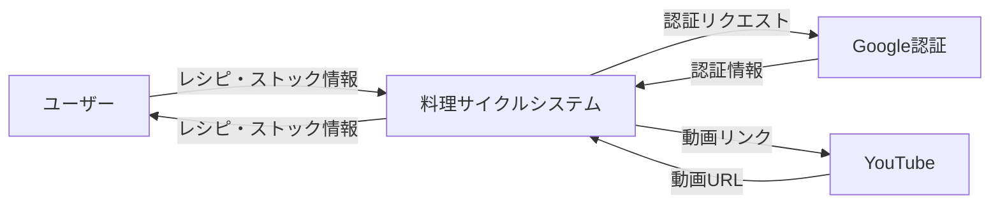
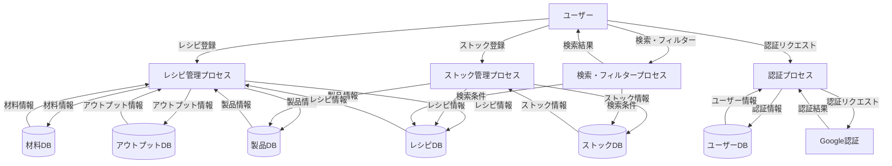
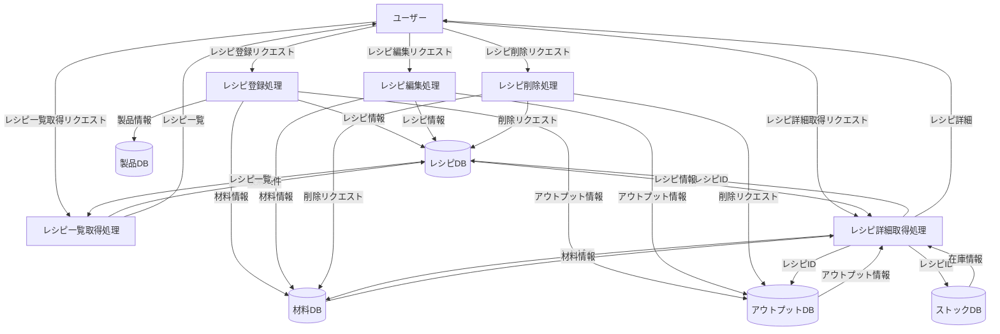
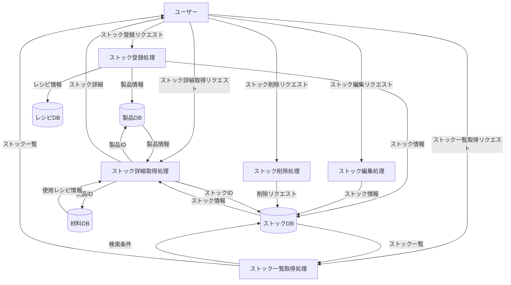
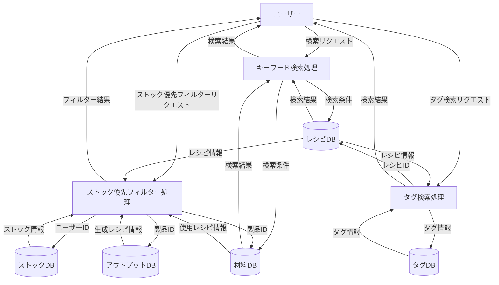
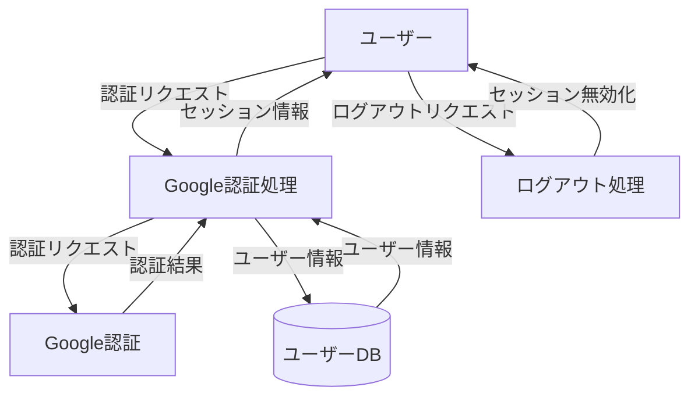

# DFD（データフローダイアグラム）

## 概要

システム全体のデータフローを可視化したダイアグラムです。

## 記号の説明

- **プロセス（円）**: データを処理する機能
- **データストア（二重線）**: データを保存する場所
- **外部エンティティ（四角）**: システム外部の存在
- **データフロー（矢印）**: データの流れ

## レベル0 DFD（コンテキスト図）

## レベル1 DFD（トップレベル）

## レベル2 DFD（詳細レベル）

### レシピ管理プロセス

### ストック管理プロセス

### 検索・フィルタープロセス

### 認証プロセス

## データストアの詳細

### レシピDB
- RECIPESテーブル
- RECIPE_COMPONENTSテーブル
- RECIPE_OUTPUTSテーブル

### ストックDB
- STOCKSテーブル

### 製品DB
- PRODUCTSテーブル

### ユーザーDB
- USERSテーブル

### タグDB（Phase 2以降）
- TAGSテーブル
- RECIPE_TAGSテーブル

## 外部エンティティ

### ユーザー
- システムの利用者
- レシピ・ストックの登録・編集・削除
- 検索・フィルターの利用

### Google認証
- OAuth 2.0認証サービス
- ユーザー認証情報の提供

### YouTube
- 動画URLの提供
- 外部アプリで動画を再生

## データフローの説明

### レシピ登録フロー
1. ユーザーがレシピ登録リクエストを送信
2. レシピ管理プロセスがレシピ情報をレシピDBに保存
3. 材料情報を材料DBに保存
4. アウトプット情報をアウトプットDBに保存
5. 製品情報を製品DBに保存（必要に応じて）
6. 登録結果をユーザーに返す

### ストック登録フロー
1. ユーザーがストック登録リクエストを送信
2. ストック管理プロセスが製品情報を製品DBに保存（必要に応じて）
3. ストック情報をストックDBに保存
4. レシピとの紐づけ情報を保存
5. 登録結果をユーザーに返す

### ストック優先フィルターフロー
1. ユーザーがストック優先フィルターリクエストを送信
2. 検索・フィルタープロセスがユーザーのストック情報を取得
3. ストックの種類に応じてレシピをフィルター
   - 完成品：アウトプットDBから該当レシピを検索
   - 中間成果物・食材：材料DBから該当レシピを検索
4. フィルター結果をユーザーに返す

### 認証フロー
1. ユーザーが認証リクエストを送信
2. 認証プロセスがGoogle認証にリダイレクト
3. Google認証が認証結果を返す
4. 認証プロセスがユーザー情報をユーザーDBに保存または更新
5. セッション情報をユーザーに返す

