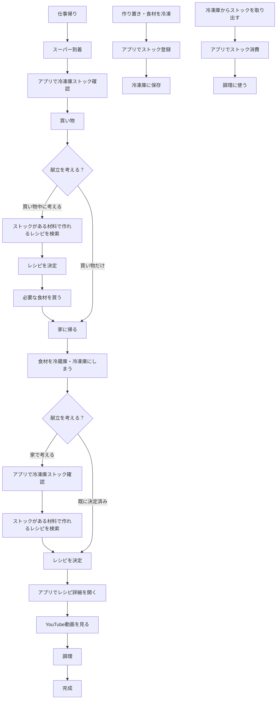
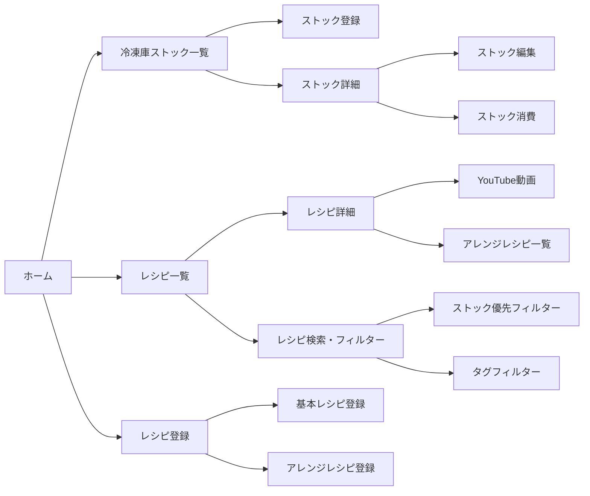

# 利用シーン・業務フロー

## 主要ユースケース

### 1. 食材調達フロー（スーパーでの買い物）

**シーン：** 仕事帰りにスーパーで買い物する

**現在の課題：**
- 冷蔵庫に何があったか覚えていない
- 冷凍庫に何がストックしてあるかわからない
- 結果として、ダブり買いをしてしまう

**利用フロー：**
1. スーパー到着
2. アプリで冷凍庫ストックを確認
3. 冷蔵庫の中身を思い出しながら買い物リストを考える
4. **買い物しながら、今日何食べようか考えることもある**
	- ストックがある材料で作れるレシピを検索・フィルター
	- レシピを選んで、必要な食材を買う
5. 大体いつも同じようなものを買う（たまに寄り道して別のものを買うこともある）
6. 買い物完了

**アプリでの操作：**
- スマホで冷凍庫ストック一覧を確認
- ストックがある食材は買わないようにする
- **ストックがある材料で作れるレシピを検索・フィルター（買い物中）**
- **レシピを選んで、必要な食材を買う（買い物中）**
- ストックがない食材を買う

### 2. 献立決定フロー（家に帰ってから / スーパーで）

**シーン：** 家に帰って食材を冷蔵庫・冷凍庫にしまった後、またはスーパーで買い物しながら、今夜何作ろうか考える

**現在の課題：**
- 冷蔵庫に何が入っているかわからない
- 作ろうかなと思う時に冷蔵庫の中身を確認しながら考える必要がある

**利用フロー（家に帰ってから）：**
1. 食材を冷蔵庫・冷凍庫にしまう
2. 今夜何作ろうか考える
3. 冷蔵庫の中身を確認しながらレシピを考える
	- 例：「キャベツがあるからキャベツのペペロンチーノ作れないかな」
	- 例：「肉あるかな？肉ないや。じゃあペペロンチーノかな」
4. 冷凍庫のストックも確認
	- 例：「ご飯が冷凍してあるから、ご飯を使ったレシピを考えよう」
5. レシピを決定

**利用フロー（スーパーで）：**
1. スーパーで買い物中
2. 今日何食べようか考える
3. アプリで冷凍庫ストックを確認
4. ストックがある材料で作れるレシピを検索・フィルター
5. レシピを選ぶ
6. 必要な食材を買う

**アプリでの操作：**
- スマホで冷凍庫ストック一覧を確認
- ストックがある材料で作れるレシピを検索・フィルター
- レシピ一覧から選ぶ

### 3. 調理フロー（キッチンで）

**シーン：** 作る時にレシピ動画を確認する

**現在の課題：**
- 作ったことあるレシピでも、材料（特に調味料）の分量を覚えていない
- 毎回YouTubeのレシピ動画を探して見るのが面倒

**利用フロー：**
1. 作るレシピを決定
2. アプリでレシピを開く
3. YouTubeのレシピ動画にリンクをクリック
4. 動画を見ながら調理
5. 完成

**アプリでの操作：**
- スマホでレシピ詳細画面を開く
- YouTube URLをクリックして動画を再生
- タイムスタンプがあれば該当箇所にジャンプ

### 4. ストック登録フロー（冷凍庫に保存する時）

**シーン：** 作り置きや食材を冷凍庫に保存する時

**利用フロー：**
1. 作り置き（ミートソース、カレーなど）をたくさん作る
2. 小分けにして冷凍庫に保存
3. アプリでストックを登録
	- 作り置き名（例：ミートソース）
	- 量（例：2食分）
	- 冷凍開始日
	- 場所メモ（例：上段奥の青いタッパー）
4. または、食材（肉、ご飯など）を冷凍庫に保存
5. アプリでストックを登録

**アプリでの操作：**
- スマホでストック登録画面を開く
- 高速入力UIで簡単に登録

### 5. ストック消費フロー（冷凍庫から取り出す時）

**シーン：** 冷凍庫のストックを使う時

**利用フロー：**
1. 冷凍庫からストックを取り出す
2. アプリでストックを消費（削除または量を減らす）
3. 調理に使う

**アプリでの操作：**
- スマホでストック一覧から該当ストックを選択
- 消費処理を実行

### 6. レシピ登録フロー（初期データ入力）

**シーン：** 今まで作ったことがあるレシピを登録する

**利用フロー：**
1. PCでアプリを開く
2. 今まで作ったことがあるレシピを登録
	- 基本レシピ（例：ペペロンチーノ）
	- アレンジレシピ（例：キャベツペペロンチーノ）
	- YouTube URL
	- タイムスタンプ（必要に応じて）
	- タグ（材料、味、調理時間など）
3. 複数のレシピをまとめて登録

**アプリでの操作：**
- PCでレシピ登録画面を開く
- フォームに入力して登録

## 業務フロー図

## ユーザージャーニー

### シナリオ1：スーパーでの買い物

1. **トリガー：** 仕事帰り、スーパーに寄る
2. **行動：** スマホでアプリを開く
3. **確認：** 冷凍庫ストック一覧を見る
4. **判断：** ストックがある食材は買わない
5. **行動：** 買い物をする
6. **結果：** ダブり買いを防げる

### シナリオ2：献立決定（家に帰ってから）

1. **トリガー：** 家に帰って、今夜何作ろうか考える
2. **行動：** スマホでアプリを開く
3. **確認：** 冷凍庫ストック一覧を見る
4. **検索：** ストックがある材料で作れるレシピをフィルター
5. **選択：** レシピを選ぶ
6. **結果：** ストックを活用した献立が決まる

### シナリオ2-2：献立決定（スーパーで）

1. **トリガー：** スーパーで買い物中、今日何食べようか考える
2. **行動：** スマホでアプリを開く
3. **確認：** 冷凍庫ストック一覧を見る
4. **検索：** ストックがある材料で作れるレシピをフィルター
5. **選択：** レシピを選ぶ
6. **行動：** 必要な食材を買う
7. **結果：** ストックを活用した献立が決まり、必要な食材を買える

### シナリオ3：調理

1. **トリガー：** 作るレシピを決定
2. **行動：** スマホでアプリを開く
3. **確認：** レシピ詳細を見る
4. **再生：** YouTube動画を開く
5. **調理：** 動画を見ながら作る
6. **結果：** 分量を間違えずに作れる

## 画面遷移図（大まか）

## 重要なポイント

### 冷蔵庫 vs 冷凍庫の管理方針

- **冷凍庫：** 日々出入りしない、流動性が低い → **管理対象**
- **冷蔵庫：** 日々出入りする、流動性が高い → **管理対象外**

### ストックの消費推奨アラート

- 冷凍開始日から1ヶ月以上経過したストックは、リスト上で目立つように表示
- 例：「1ヶ月前に作ったカレーがまだ残っている」ことを知らせる

### デバイス別の利用シーン

- **PC：** 初期データ入力（レシピ登録など）、まとめて登録
- **スマホ：** スーパー、キッチンでの利用、日常的な操作

