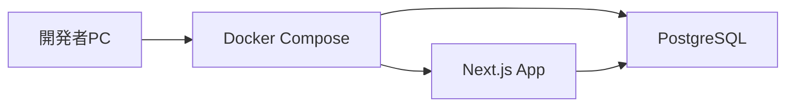
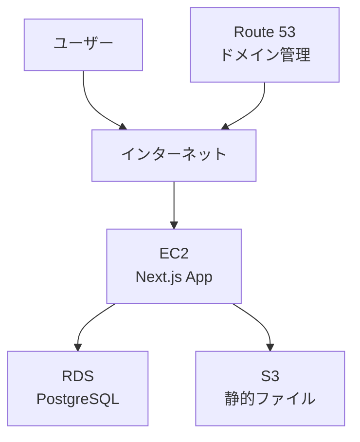

# インフラ構成

## ローカル開発環境

### Docker Compose

- **Next.jsアプリケーション：** 開発サーバー
- **PostgreSQL：** データベース
- **環境変数：** `.env.local` で管理

### 構成

## AWS本番環境構成（検討事項）

### 選定サービス（候補）

以下は現時点での候補です。実際の要件やコストを考慮して検討します。

- **EC2：** アプリケーションサーバー（Next.jsアプリをデプロイ）
- **RDS：** PostgreSQLデータベース
- **S3：** 静的ファイル（必要に応じて）
- **Route 53：** ドメイン管理（必要に応じて）

### 選定理由・検討事項

#### EC2

**選定理由（候補）：**
- シンプルで学習しやすい
- 個人利用なら十分な性能
- 自分でサーバーを管理できる（学習目的）

**検討事項：**
- インスタンスタイプの選定（t2.micro, t3.micro等）
- ストレージ容量
- セキュリティグループの設定
- 自動スケーリングの必要性（個人利用なら不要かも）

**代替案：**
- **Elastic Beanstalk：** より簡単にデプロイできるが、学習目的には向かないかも
- **ECS/Fargate：** コンテナベースだが、複雑になる可能性

#### RDS

**選定理由（候補）：**
- マネージドサービスで運用が楽
- バックアップも自動
- セキュリティパッチも自動適用

**検討事項：**
- インスタンスタイプの選定（db.t3.micro等）
- ストレージ容量
- マルチAZの必要性（個人利用なら不要かも）
- バックアップ保持期間

**代替案：**
- **EC2上でPostgreSQLを直接構築：** より学習になるが、運用が大変

#### S3

**選定理由（候補）：**
- 将来的に画像アップロード機能を追加する可能性があるため
- 静的ファイルのホスティングにも使える

**検討事項：**
- 実際に画像アップロード機能が必要か（Phase 3以降かも）
- CloudFrontとの連携の必要性

**代替案：**
- 画像アップロード機能が不要なら、S3は不要かも

#### Route 53

**選定理由（候補）：**
- 独自ドメインを使う場合

**検討事項：**
- 独自ドメインを使うかどうか
- ドメインの取得・管理

**代替案：**
- 独自ドメインが不要なら、Route 53は不要

### その他の検討事項

- **ロードバランサー：** 個人利用なら不要かも
- **CloudFront：** 静的ファイルの配信を高速化できるが、必要かどうか
- **VPC：** セキュリティのため必要かどうか
- **コスト：** 個人利用なので、できるだけ安く抑えたい

### 構成図

### セキュリティ

- **認証：** Google認証を実装
- **HTTPS：** 必須
- **セキュリティグループ：** 適切に設定

### デプロイフロー

1. ローカルで開発・テスト
2. Gitにコミット・プッシュ
3. EC2にデプロイ（手動またはCI/CD）
4. 動作確認

### 学習目的

- インフラ設定を自分で行う経験
- AWSの基礎知識を身につける
- 実際に使える環境を構築する

